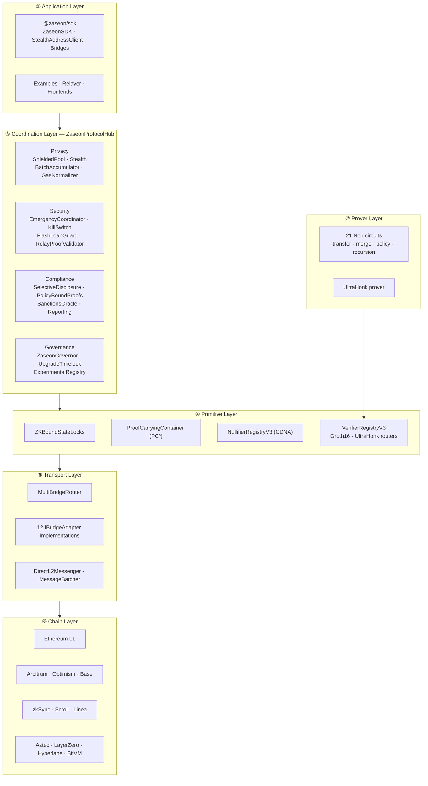
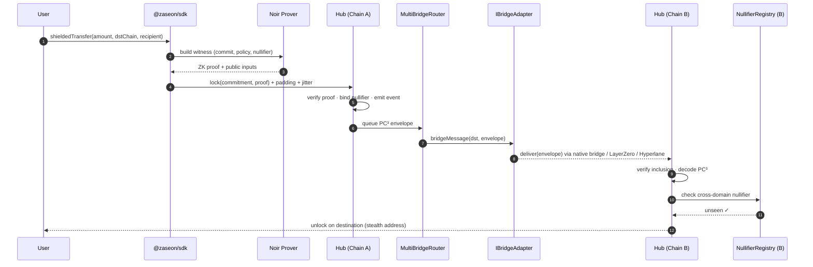

<h1 align="center">ZASEON</h1>

<p align="center">
  <strong>Cross-chain ZK privacy middleware for confidential state transfer across L2 networks.</strong>
</p>

<p align="center">
  <a href="https://opensource.org/licenses/MIT"></a>
  <a href="https://docs.soliditylang.org/"></a>
  <a href="https://getfoundry.sh/"></a>
  <a href="https://openzeppelin.com/contracts/"></a>
  <a href="https://noir-lang.org/"></a>
  <a href="https://www.certora.com/"></a>
  <br/>
  <a href="#"></a>
  <a href="#"></a>
  <a href="#"></a>
</p>

<p align="center">
  <a href="docs/GETTING_STARTED.md">Getting&nbsp;Started</a> •
  <a href="docs/INTEGRATION_GUIDE.md">SDK&nbsp;Guide</a> •
  <a href="docs/architecture.md">Architecture</a> •
  <a href="docs/THREAT_MODEL.md">Threat&nbsp;Model</a> •
  <a href="docs/FORMAL_VERIFICATION.md">Formal&nbsp;Verification</a> •
  <a href="SECURITY.md">Security</a>
</p>

---

## Why Zaseon

Today, **privacy on Ethereum means lock-in**. A shielded balance on one rollup cannot move to another without leaking amounts, timing, and address links at the bridge boundary — the exact metadata zero-knowledge was supposed to hide.

Zaseon closes that gap. Lock encrypted state on Chain A, unlock it on Chain B with a single zero-knowledge proof. Metadata does not cross the boundary. Trust assumptions do not expand beyond the math.

> **The thesis:** privacy is not a feature of a chain — it is a property of the _path_ value takes across chains. Zaseon secures that path.

---

## Table of Contents

- [At a Glance](#at-a-glance)
- [Quick Start](#quick-start)
- [Architecture](#architecture)
- [Core Primitives](#core-primitives)
- [Supported Networks](#supported-networks)
- [SDK](#sdk)
- [Security](#security)
- [Project Structure](#project-structure)
- [Development](#development)
- [Deploy Scripts](#deploy-scripts)
- [Deployments](#deployments)
- [Documentation](#documentation)
- [Contributing](#contributing)
- [License](#license)

---

## At a Glance

|                         |                                                                                                                             |
| ----------------------- | --------------------------------------------------------------------------------------------------------------------------- |
| **Contracts**           | ~250 production Solidity files (0.8.24, via_ir, optimizer runs = 10,000)                                                    |
| **Interfaces**          | 51 typed module interfaces                                                                                                  |
| **ZK Circuits**         | 21 Noir circuits with on-chain UltraHonk verifiers                                                                          |
| **Bridge Adapters**     | 12 — Arbitrum, Optimism, Base, zkSync, Scroll, Linea, Aztec, Ethereum L1, LayerZero V2, Hyperlane, BitVM, Native L2 wrapper |
| **Tests**               | **6,192+ passing** — Foundry fuzz (10k runs), invariant, fork, Hardhat integration, attack simulation                       |
| **Formal Verification** | 109 Certora CVL specs (73 configs) · K Framework · TLA+ · Halmos · Echidna                                                  |
| **SDK**                 | 65+ TypeScript / viem modules (`@zaseon/sdk`)                                                                               |
| **Privacy Layers**      | 12-layer metadata leakage reduction (gas normalization → SDK decoy traffic)                                                 |
| **Deploy Pipeline**     | 16 phased Foundry scripts — mainnet, per-L2, minimal, modular                                                               |
| **Documentation**       | 54 documents · 13 ADRs                                                                                                      |

---

## Quick Start

**Prerequisites:** [Foundry](https://getfoundry.sh/), Node.js ≥ 18, [Noir](https://noir-lang.org/) (optional, for circuit work).

```bash
git clone https://github.com/Soul-Research-Labs/ZAseon.git
cd ZAseon

# Install dependencies
forge install
npm install

# Build + test
forge build
forge test -vvv
```

Run an end-to-end demo:

```bash
cd examples/e2e-local
make demo
```

---

## Architecture

Zaseon is organised as **six horizontal layers**. Each layer has a single responsibility, a typed interface, and a formal spec surface. Everything above the transport layer is chain-agnostic.

### System topology



### Cross-chain transfer lifecycle

A shielded transfer from Chain A to Chain B flows through the protocol as follows — no plaintext amounts, recipients, or timing signals cross any boundary in the clear.



### Layer responsibilities

| Layer              | Responsibility                                                                           | Key Contracts / Modules                                                                       |
| ------------------ | ---------------------------------------------------------------------------------------- | --------------------------------------------------------------------------------------------- |
| ① **Application**  | Proof construction, client-side privacy, decoy traffic, submission jitter                | `@zaseon/sdk` · `StealthAddressClient` · `DecoyTrafficManager`                                |
| ② **Prover**       | 21 Noir circuits producing UltraHonk proofs with domain-separated public inputs          | `noir/` · `aggregator` · `liquidity_proof`                                                    |
| ③ **Coordination** | `ZaseonProtocolHub` wires 23 components across Privacy, Security, Compliance, Governance | `ZaseonProtocolHub` · `ComponentRegistry`                                                     |
| ④ **Primitives**   | Locks, containers, nullifiers, verifier routing — the ZK trust kernel                    | `ZKBoundStateLocks` · `ProofCarryingContainer` · `NullifierRegistryV3` · `VerifierRegistryV3` |
| ⑤ **Transport**    | Bridge abstraction with failover, fee estimation, quorum & replay protection             | `MultiBridgeRouter` · 12 × `IBridgeAdapter` · `DirectL2Messenger`                             |
| ⑥ **Chain**        | Settlement on L1, L2 rollups, and external messaging networks                            | Ethereum · Arbitrum · Optimism · Base · zkSync · Scroll · Linea · Aztec · Bitcoin (BitVM)     |

### Trust boundaries at a glance

- **Inside a proof** — arithmetic correctness is the only trust assumption.
- **Across chains** — each bridge adapter declares its security model (optimistic, ZK light-client, multisig, multi-oracle); `MultiBridgeRouter` enforces quorum policy over the mix.
- **At governance** — all privileged setters emit typed events and sit behind `ZaseonUpgradeTimelock`.
- **At emergency** — `ProtocolEmergencyCoordinator` + `CrossChainEmergencyRelay` propagate a signed pause across every chain in bounded time.

Full walkthrough in [docs/architecture.md](docs/architecture.md). Per-adapter security models in [docs/BRIDGE_COMPARISON_MATRIX.md](docs/BRIDGE_COMPARISON_MATRIX.md).

---

## Core Primitives

| Primitive                                 | What it does                                                                                         |
| ----------------------------------------- | ---------------------------------------------------------------------------------------------------- |
| **ZK-Bound State Locks**                  | Lock state on the source chain; unlock on the destination with a ZK proof of the lock's satisfaction |
| **Proof-Carrying Containers (PC³)**       | Bundle a state transition with its validity proof for trust-minimized cross-chain transport          |
| **Cross-Domain Nullifier Algebra (CDNA)** | Domain-separated nullifiers that prevent double-spend across every supported chain                   |
| **Policy-Bound Proofs**                   | ZK proofs with embedded compliance constraints — enforce rules without revealing data                |
| **Stealth Addresses**                     | ERC-5564-compliant registry for receiver-unlinkable payments                                         |
| **12-Layer Metadata Protection**          | Progressive defenses from gas normalization to SDK-level decoy traffic & submission jitter           |

---

## Supported Networks

| Network             | Bridge Type                    | Adapter                 |
| ------------------- | ------------------------------ | ----------------------- |
| Arbitrum One / Nova | Retryable Tickets              | `ArbitrumBridgeAdapter` |
| Optimism            | OP Stack native                | `OptimismBridgeAdapter` |
| Base                | OP Stack native                | `BaseBridgeAdapter`     |
| zkSync Era          | Diamond Proxy                  | `zkSyncBridgeAdapter`   |
| Scroll              | Native messaging               | `ScrollBridgeAdapter`   |
| Linea               | MessageService                 | `LineaBridgeAdapter`    |
| Aztec               | Rollup bridge                  | `AztecBridgeAdapter`    |
| Ethereum L1         | Deposit / withdrawal           | `EthereumL1Bridge`      |
| 120+ chains         | LayerZero V2 OApp              | `LayerZeroAdapter`      |
| Modular ISM         | Hyperlane Mailbox              | `HyperlaneAdapter`      |
| Bitcoin             | BitVM attestation              | `BitVMAdapter`          |
| Any L2              | Unified IBridgeAdapter wrapper | `NativeL2BridgeWrapper` |

All adapters implement `IBridgeAdapter` — `bridgeMessage`, `estimateFee`, `isMessageVerified`.

---

## SDK

> The SDK is not yet published to npm. Install locally via `npm install file:./sdk`.

```typescript
import { ZaseonSDK } from "@zaseon/sdk";

const sdk = new ZaseonSDK({ rpcUrl: process.env.RPC_URL! });

// Shielded cross-chain transfer
await sdk.shieldedTransfer({
  fromChain: "arbitrum",
  toChain: "optimism",
  amount: "1.0",
  token: "ETH",
});

// Generate a stealth address for the receiver
const stealth = await sdk.stealthAddress.generate(recipientPublicKey);

// Create a ZK-bound state lock
const lock = await sdk.stateLocks.create({
  sourceChain: "base",
  destChain: "scroll",
  state: encryptedState,
});
```

Runnable examples live in [`examples/`](examples/) — private payment, SDK quickstart, and ZK state locks demo.

---

## Security

Zaseon employs defense-in-depth across every layer of the stack.

**Protocol guarantees**

- Signature malleability protection on all ECDSA operations
- Cross-chain replay protection via chain-ID binding
- `ReentrancyGuard` on every state-mutating entry point
- Zero-address and bounds validation on every privileged setter
- Admin-state observability — every governance-mutable value emits a typed event
- Experimental-feature registry with an explicit graduation pipeline

**Privacy: 12-layer metadata leakage reduction**

Gas normalization (6 tiers) · proof padding (4 tiers) · message padding (3 tiers) · multi-relayer quorum · denomination enforcement · relay jitter · mixnet path enforcement · adaptive batching · SDK decoy traffic · submission jitter · polling jitter · VRF relayer selection.

**Formal & dynamic analysis**

109 Certora CVL specs · 73 verification configs · K Framework models · TLA+ liveness specs · Halmos symbolic execution · Echidna property fuzzing · Foundry invariant suite.

Disclosures: [`SECURITY.md`](SECURITY.md). Full threat model: [`docs/THREAT_MODEL.md`](docs/THREAT_MODEL.md).

---

## Project Structure

```
contracts/               # ~250 production Solidity files
  core/                  # ZaseonProtocolHub, Orchestrator, NullifierRegistryV3
  bridge/                # MultiBridgeRouter, CrossChainProofHubV3, liquidity vault
  crosschain/            # 12 bridge adapters, DirectL2Messenger, BridgeAdapterBase
  privacy/               # StealthAddressRegistry, ShieldedPool, BatchAccumulator, GasNormalizer
  security/              # SecurityModule, EmergencyCoordinator, FlashLoanGuard, RelayProofValidator
  primitives/            # ZKBoundStateLocks, ProofCarryingContainer
  verifiers/             # Groth16, UltraHonk, Noir adapters + generated verifiers
  relayer/               # DecentralizedRelayerRegistry, RelayerHealthMonitor, VRFSelector
  compliance/            # SelectiveDisclosure, ComplianceReporting, SanctionsOracle
  governance/            # ZaseonGovernor, ZaseonUpgradeTimelock
  integrations/          # DeFi protocol integrations (Uniswap, etc.)
  adapters/              # EVMUniversalAdapter, NativeL2BridgeWrapper
  libraries/             # ProofEnvelope, FixedSizeMessageWrapper, CrossChainMessageCodec
  interfaces/            # 51 typed interfaces
  upgradeable/           # 16 UUPS-proxy upgradeable variants
noir/                    # 21 Noir ZK circuits
sdk/                     # TypeScript SDK (ZaseonSDK, StealthAddressClient, bridges)
test/                    # Foundry + Hardhat tests (6,192+ passing)
scripts/deploy/          # 16 Foundry deploy scripts + shell/TS helpers
certora/                 # 109 CVL specs · 73 configs
specs/                   # K Framework + TLA+ formal specs
monitoring/              # OpenZeppelin Defender + Tenderly configs
docs/                    # 54 documents · 13 ADRs
examples/                # SDK quickstart, private payment, ZK demo, e2e-local
```

---

## Development

**Build & test**

```bash
forge build                                      # Foundry (via_ir, optimizer 10000)
forge test -vvv                                  # Full Foundry suite
forge test --no-match-path 'test/stress/*' -vvv  # Skip stress suite
forge test --fuzz-runs 10000                     # Full fuzz campaign
npx hardhat test                                 # Hardhat integration tests
```

**Coverage & analysis**

```bash
forge coverage                                   # Coverage report
npm run coverage:modular                         # Per-module coverage
```

**ZK circuits**

```bash
npm run noir:all                                 # Compile + codegen all 21 circuits
```

**Security pipeline**

```bash
npm run security:ci                              # Full CI security pipeline
npm run certora:check                            # Compile-check all Certora specs
```

---

## Deploy Scripts

| Script                              | Purpose                             |
| ----------------------------------- | ----------------------------------- |
| `DeployMainnet.s.sol`               | Full production 8-phase deploy      |
| `DeployL2Bridges.s.sol`             | Bridge adapters per L2              |
| `DeployMinimalCore.s.sol`           | Minimal core contracts              |
| `DeploySecurityComponents.s.sol`    | Security infrastructure             |
| `DeployPrivacyComponents.s.sol`     | Privacy modules                     |
| `DeployComplianceSuite.s.sol`       | Compliance contracts                |
| `DeployIntentSuite.s.sol`           | Intent completion layer             |
| `DeployRoutingSuite.s.sol`          | Dynamic routing                     |
| `DeployRelayerInfrastructure.s.sol` | Relayer infrastructure              |
| `DeployRiskMitigation.s.sol`        | Risk mitigation contracts           |
| `DeployUniswapAdapters.s.sol`       | Uniswap integrations                |
| `DeployZaseonLite.s.sol`            | Lightweight deployment variant      |
| `WireRemainingComponents.s.sol`     | Post-deploy hub wiring              |
| `WireIntentComponents.s.sol`        | Intent component wiring             |
| `ConfigureCrossChain.s.sol`         | Link L1 hub with L2 chains          |
| `ConfirmRoleSeparation.s.sol`       | Lock admin/operator role separation |

---

## Deployments

Testnet deployments are live on **Ethereum Sepolia** (`chainId 11155111`). Addresses: [`deployments/sepolia-11155111.json`](deployments/sepolia-11155111.json).

```bash
forge script scripts/deploy/DeployMainnet.s.sol \
  --rpc-url     $RPC_URL \
  --private-key $PRIVATE_KEY \
  --broadcast
```

Mainnet deployment: see the [mainnet security checklist](docs/MAINNET_SECURITY_CHECKLIST.md) and [deployment runbook](docs/DEPLOYMENT_CHECKLIST.md).

---

## Documentation

| Topic                     | Link                                                                   |
| ------------------------- | ---------------------------------------------------------------------- |
| Getting Started           | [docs/GETTING_STARTED.md](docs/GETTING_STARTED.md)                     |
| Integration Guide         | [docs/INTEGRATION_GUIDE.md](docs/INTEGRATION_GUIDE.md)                 |
| Architecture              | [docs/architecture.md](docs/architecture.md)                           |
| Solidity API Reference    | [docs/SOLIDITY_API_REFERENCE.md](docs/SOLIDITY_API_REFERENCE.md)       |
| Bridge Integration        | [docs/BRIDGE_INTEGRATION.md](docs/BRIDGE_INTEGRATION.md)               |
| Bridge Comparison Matrix  | [docs/BRIDGE_COMPARISON_MATRIX.md](docs/BRIDGE_COMPARISON_MATRIX.md)   |
| Stealth Addresses         | [docs/STEALTH_ADDRESSES.md](docs/STEALTH_ADDRESSES.md)                 |
| Deployment                | [docs/DEPLOYMENT.md](docs/DEPLOYMENT.md)                               |
| Upgrade Guide             | [docs/UPGRADE_GUIDE.md](docs/UPGRADE_GUIDE.md)                         |
| Governance                | [docs/GOVERNANCE.md](docs/GOVERNANCE.md)                               |
| Threat Model              | [docs/THREAT_MODEL.md](docs/THREAT_MODEL.md)                           |
| Formal Verification       | [docs/FORMAL_VERIFICATION.md](docs/FORMAL_VERIFICATION.md)             |
| Incident Response Runbook | [docs/INCIDENT_RESPONSE_RUNBOOK.md](docs/INCIDENT_RESPONSE_RUNBOOK.md) |
| All docs                  | [docs/](docs/)                                                         |

---

## Contributing

Contributions are welcome. The workflow is **fork → branch → test → PR**.

- Security-critical code requires a Certora CVL spec.
- All new features require fuzz tests (Foundry, `--fuzz-runs 10000`).
- Follow existing patterns in [`contracts/interfaces/`](contracts/interfaces/).
- Generated verifier code in [`contracts/verifiers/generated/`](contracts/verifiers/generated/) must not be modified by hand.
- Run `npm run security:ci` before opening a PR.

Responsible disclosure: [`SECURITY.md`](SECURITY.md).

---

## License

Released under the [MIT License](LICENSE). © 2026 Zaseon / Soul Research Labs.

<p align="center">
  <strong>ZASEON</strong>
</p>

<p align="center">
  Cross-chain ZK privacy middleware for confidential state transfer across L2 networks
</p>

<p align="center">
  <a href="https://opensource.org/licenses/MIT"></a>
  <a href="https://docs.soliditylang.org/"></a>
  <a href="https://getfoundry.sh/"></a>
  <a href="https://openzeppelin.com/contracts/"></a>
  <a href="https://noir-lang.org/"></a>
</p>

---

Today, privacy means lock-in. Your shielded balance on one chain can't move to another without leaking timing, amounts, and address links at bridge boundaries. Zaseon solves this: lock encrypted state on Chain A, unlock it on Chain B with a zero-knowledge proof — no metadata exposed, no chain dependency, no trust assumptions beyond the math.

## Quick Start

```bash
git clone https://github.com/Soul-Research-Labs/ZASEON.git
cd ZASEON
forge install && npm install
forge build
forge test -vvv
```

## Architecture

```
┌─────────────────────────────────────────────────────────────────────┐
│                        ZaseonProtocolHub                            │
│               (Central coordination — 23 components)                │
├───────────┬───────────┬──────────────┬──────────────┬───────────────┤
│  Privacy  │  Bridge   │   Security   │  Compliance  │  Governance   │
│           │           │              │              │               │
│ Shielded  │ Multi-    │ Emergency    │ Selective    │ ZaseonGovernor│
│ Pool      │ Bridge    │ Coordinator  │ Disclosure   │               │
│           │ Router    │              │              │ Upgrade       │
│ Stealth   │           │ Relay Proof  │ Policy-Bound │ Timelock      │
│ Addresses │ 12 Bridge │ Validator    │ Proofs       │               │
│           │ Adapters  │              │              │               │
│ Batch     │           │ Flash Loan   │ Compliance   │               │
│ Accum.    │ DirectL2  │ Guard        │ Reporting    │               │
│           │ Messenger │              │              │               │
│ Gas       │           │ Kill Switch  │ Sanctions    │               │
│ Normalizer│           │              │ Check        │               │
└───────────┴───────────┴──────────────┴──────────────┴───────────────┘
                               │
                    ┌──────────┴──────────┐
                    │   21 Noir Circuits  │
                    │   (ZK Proofs)       │
                    └─────────────────────┘
```

## At a Glance

|                         |                                                                                                          |
| ----------------------- | -------------------------------------------------------------------------------------------------------- |
| **Contracts**           | ~250 production Solidity (0.8.24) — core, bridges, privacy, security, governance, relayer, compliance    |
| **Interfaces**          | 51 typed interfaces across all modules                                                                   |
| **ZK Circuits**         | 21 Noir circuits with on-chain UltraHonk verifiers                                                       |
| **Bridge Adapters**     | 12 — Arbitrum, Optimism, Base, zkSync, Scroll, Linea, Aztec, L1, LayerZero, Hyperlane, BitVM, Native L2  |
| **Tests**               | 6,192+ passing — Foundry fuzz (10k runs), invariant, fork, Hardhat integration, attack simulation        |
| **Formal Verification** | 109 Certora CVL specs, 73 configs, K Framework, TLA+, Halmos, Echidna                                    |
| **SDK**                 | 65+ TypeScript/viem modules (`@zaseon/sdk`)                                                              |
| **Privacy**             | 12-layer metadata leakage reduction — gas normalization, proof padding, relay jitter, mixnet enforcement |
| **Deploy Scripts**      | 16 Foundry scripts — phased mainnet, per-L2, minimal, modular                                            |
| **Documentation**       | 54 docs including 13 ADRs                                                                                |

## Key Primitives

| Primitive                           | Purpose                                                                 |
| ----------------------------------- | ----------------------------------------------------------------------- |
| **ZK-Bound State Locks**            | Lock state on source chain, unlock on destination with ZK proof         |
| **Proof-Carrying Containers (PC³)** | Bundle state transitions with validity proofs for cross-chain transport |
| **Cross-Domain Nullifier Algebra**  | Domain-separated nullifiers preventing double-spend across chains       |
| **Policy-Bound Proofs**             | ZK proofs with embedded compliance constraints                          |
| **Stealth Addresses**               | ERC-5564 stealth address registry for receiver privacy                  |
| **12-Layer Metadata Protection**    | Progressive defenses from gas normalization to SDK-level decoy traffic  |

## Supported Networks

| Network     | Bridge Type                | Adapter                 |
| ----------- | -------------------------- | ----------------------- |
| Arbitrum    | Native (Retryable Tickets) | `ArbitrumBridgeAdapter` |
| Optimism    | Native (OP Stack)          | `OptimismBridgeAdapter` |
| Base        | Native (OP Stack)          | `BaseBridgeAdapter`     |
| zkSync Era  | Native (Diamond Proxy)     | `zkSyncBridgeAdapter`   |
| Scroll      | Native Messaging           | `ScrollBridgeAdapter`   |
| Linea       | Native (MessageService)    | `LineaBridgeAdapter`    |
| Aztec       | Rollup Bridge              | `AztecBridgeAdapter`    |
| Ethereum L1 | Deposit/Withdrawal         | `EthereumL1Bridge`      |
| 120+ Chains | LayerZero V2 OApp          | `LayerZeroAdapter`      |
| Modular ISM | Hyperlane Mailbox          | `HyperlaneAdapter`      |
| Bitcoin     | BitVM Attestation          | `BitVMAdapter`          |
| Any L2      | Unified Wrapper            | `NativeL2BridgeWrapper` |

All adapters implement `IBridgeAdapter` (`bridgeMessage`, `estimateFee`, `isMessageVerified`).

## Project Structure

```
contracts/               # ~250 production Solidity files
  core/                  # ZaseonProtocolHub, Orchestrator
  bridge/                # MultiBridgeRouter, CrossChainProofHubV3
  crosschain/            # 12 bridge adapters, DirectL2Messenger
  privacy/               # StealthAddressRegistry, ShieldedPool, BatchAccumulator, GasNormalizer
  security/              # SecurityModule, EmergencyCoordinator, FlashLoanGuard, RelayProofValidator
  primitives/            # ZKBoundStateLocks, ProofCarryingContainer
  verifiers/             # Groth16, UltraHonk, Noir adapters + generated verifiers
  relayer/               # DecentralizedRelayerRegistry, RelayerHealthMonitor
  compliance/            # SelectiveDisclosure, ComplianceReporting
  governance/            # ZaseonGovernor, ZaseonUpgradeTimelock
  integrations/          # DeFi protocol integrations (Uniswap, etc.)
  adapters/              # EVMUniversalAdapter, NativeL2BridgeWrapper
  libraries/             # ProofEnvelope, FixedSizeMessageWrapper, CrossChainMessageCodec
  interfaces/            # 51 interfaces
  upgradeable/           # 16 UUPS proxy upgradeable variants
noir/                    # 21 Noir ZK circuits
sdk/                     # TypeScript SDK (ZaseonSDK, StealthAddressClient, bridges)
test/                    # Foundry tests + Hardhat tests (6,192+ passing)
scripts/deploy/          # 16 Foundry deploy scripts + shell/TS helpers
certora/                 # 109 CVL specs, 73 configs
specs/                   # K Framework, TLA+ formal specs
monitoring/              # Defender + Tenderly configs
docs/                    # 54 documentation files + ADRs
examples/                # SDK quickstart, private payment, ZK demo
```

## SDK

> **Note:** The SDK is not yet published to npm. Install locally via `npm install file:./sdk`.

```typescript
import { ZaseonSDK } from "@zaseon/sdk";

const sdk = new ZaseonSDK({ rpcUrl: "..." });

// Shielded cross-chain transfer
await sdk.shieldedTransfer({
  fromChain: "arbitrum",
  toChain: "optimism",
  amount: "1.0",
  token: "ETH",
});

// Generate stealth address
const stealth = await sdk.stealthAddress.generate(recipientPublicKey);

// Create ZK-bound state lock
const lock = await sdk.stateLocks.create({
  sourceChain: "base",
  destChain: "scroll",
  state: encryptedState,
});
```

See [`examples/`](examples/) for runnable demos: **private payment**, **SDK quickstart**, and **ZK state locks**.

## Security

Zaseon employs defense-in-depth across the entire stack:

- **21 security modules** — Emergency coordinator, kill switch, flash loan guard, relay proof validator, protocol health aggregator
- **12-layer metadata protection** — Gas normalization (6 tiers), proof padding (4 tiers), message padding (3 tiers), multi-relayer quorum, denomination enforcement, relay jitter, mixnet path enforcement, adaptive batching, SDK decoy traffic & submission/polling jitter
- **Formal verification** — 109 Certora CVL specs with 73 configurations, K Framework, TLA+, Halmos symbolic execution, Echidna fuzzing
- **Signature malleability protection** on all ECDSA operations
- **Cross-chain replay protection** via chain ID validation
- **ReentrancyGuard** on all state-changing functions
- **Zero-address validation** on critical setters
- **Experimental feature registry** with graduation pipeline

See [SECURITY.md](SECURITY.md) for vulnerability reporting and [docs/THREAT_MODEL.md](docs/THREAT_MODEL.md) for the full threat model.

## Development

### Commands

```bash
# Build
forge build                                        # Foundry (via_ir, optimizer 10000)
npx hardhat compile                                # Hardhat

# Test
forge test -vvv                                    # All Foundry tests
forge test --no-match-path 'test/stress/*' -vvv    # Skip stress tests
npx hardhat test                                   # Hardhat tests
forge test --fuzz-runs 10000                       # Full fuzz campaign

# Coverage & Analysis
forge coverage                                     # Coverage report
npm run coverage:modular                           # Per-module coverage

# Noir Circuits
npm run noir:all                                   # Compile + codegen all circuits

# Security
npm run security:ci                                # Full CI security pipeline
npm run certora:check                              # Compile-check all Certora specs
```

### Deploy Scripts

| Script                              | Purpose                         |
| ----------------------------------- | ------------------------------- |
| `DeployMainnet.s.sol`               | Full production 8-phase deploy  |
| `DeployL2Bridges.s.sol`             | Bridge adapters per L2          |
| `DeployMinimalCore.s.sol`           | Minimal core contracts          |
| `DeploySecurityComponents.s.sol`    | Security infrastructure         |
| `DeployPrivacyComponents.s.sol`     | Privacy modules                 |
| `DeployComplianceSuite.s.sol`       | Compliance contracts            |
| `DeployIntentSuite.s.sol`           | Intent completion layer         |
| `DeployRoutingSuite.s.sol`          | Dynamic routing                 |
| `DeployRelayerInfrastructure.s.sol` | Relayer infrastructure          |
| `DeployRiskMitigation.s.sol`        | Risk mitigation contracts       |
| `DeployUniswapAdapters.s.sol`       | Uniswap integrations            |
| `DeployZaseonLite.s.sol`            | Lightweight variant             |
| `WireRemainingComponents.s.sol`     | Post-deploy hub wiring          |
| `WireIntentComponents.s.sol`        | Intent component wiring         |
| `ConfigureCrossChain.s.sol`         | Link L1 hub with L2 chains      |
| `ConfirmRoleSeparation.s.sol`       | Lock role separation (multisig) |

## Deployments

Testnet deployments available on **Ethereum Sepolia** (`11155111`). See [`deployments/`](deployments/) for addresses.

```bash
forge script scripts/deploy/DeployMainnet.s.sol --rpc-url $RPC_URL --broadcast
```

## Documentation

| Topic               | Link                                                                   |
| ------------------- | ---------------------------------------------------------------------- |
| Getting Started     | [docs/GETTING_STARTED.md](docs/GETTING_STARTED.md)                     |
| Integration Guide   | [docs/INTEGRATION_GUIDE.md](docs/INTEGRATION_GUIDE.md)                 |
| Architecture        | [docs/architecture.md](docs/architecture.md)                           |
| API Reference       | [docs/SOLIDITY_API_REFERENCE.md](docs/SOLIDITY_API_REFERENCE.md)       |
| Bridge Integration  | [docs/BRIDGE_INTEGRATION.md](docs/BRIDGE_INTEGRATION.md)               |
| Bridge Comparison   | [docs/BRIDGE_COMPARISON_MATRIX.md](docs/BRIDGE_COMPARISON_MATRIX.md)   |
| Stealth Addresses   | [docs/STEALTH_ADDRESSES.md](docs/STEALTH_ADDRESSES.md)                 |
| Deployment          | [docs/DEPLOYMENT.md](docs/DEPLOYMENT.md)                               |
| Upgrade Guide       | [docs/UPGRADE_GUIDE.md](docs/UPGRADE_GUIDE.md)                         |
| Governance          | [docs/GOVERNANCE.md](docs/GOVERNANCE.md)                               |
| Threat Model        | [docs/THREAT_MODEL.md](docs/THREAT_MODEL.md)                           |
| Formal Verification | [docs/FORMAL_VERIFICATION.md](docs/FORMAL_VERIFICATION.md)             |
| Incident Response   | [docs/INCIDENT_RESPONSE_RUNBOOK.md](docs/INCIDENT_RESPONSE_RUNBOOK.md) |
| All docs            | [docs/](docs/)                                                         |

## Contributing

Fork → branch → test → PR.

- Security-critical code requires Certora specs
- All features need fuzz tests
- Follow existing patterns in `contracts/interfaces/`
- Generated verifier code (`contracts/verifiers/generated/`) must not be modified

See [SECURITY.md](SECURITY.md) for vulnerability reporting.

## License

[MIT](LICENSE) — Copyright (c) 2026 Zaseon
