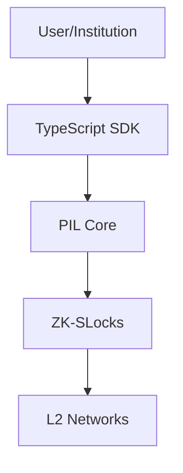
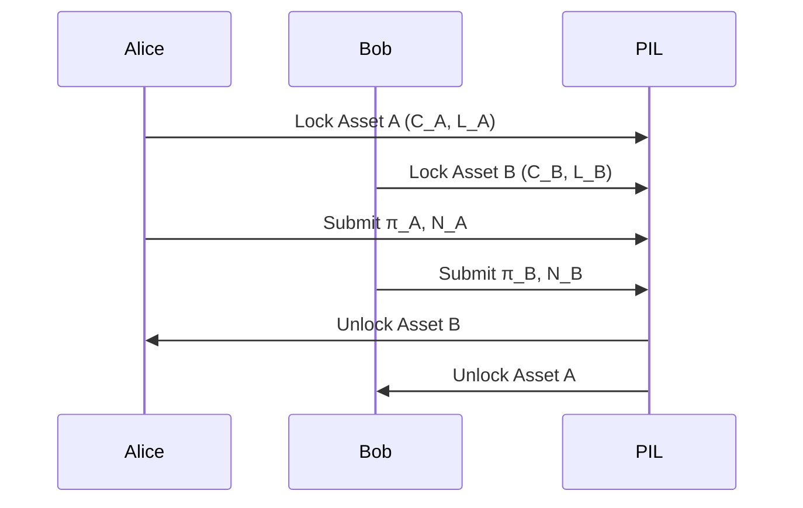
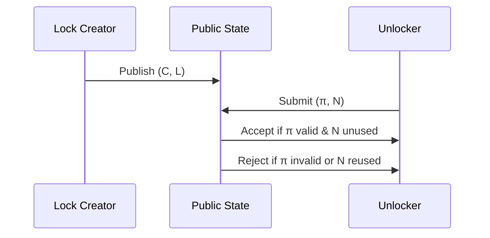
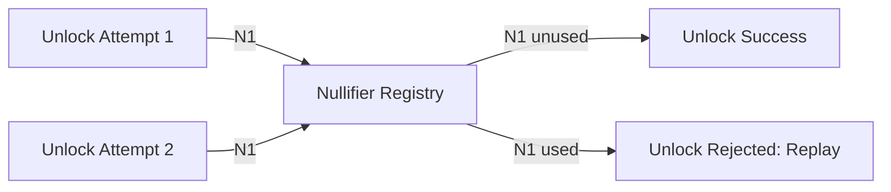
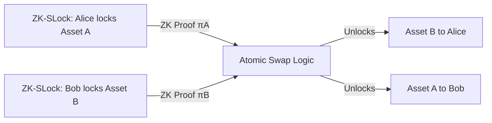

# ZK-SLocks: A Formal Cryptographic Primitive

---

- [Notation](#notation)
- [Cryptographic Assumptions](#cryptographic-assumptions)
- [Adversarial Model](#adversarial-model)
- [Protocol Pseudocode](#protocol-pseudocode)
- [Parameterization and Instantiation](#parameterization-and-instantiation)
- [Formal Security Proofs](#formal-security-proofs)
- [Security Reductions](#security-reductions)
- [Test Vectors](#test-vectors)
- [Open Problems and Limitations](#open-problems-and-limitations)
## Notation

- $C$ : Commitment
- $m$ : Message/state/asset
- $r$ : Randomness for commitment
- $L$ : Predicate (unlocking condition)
- $w$ : Witness
- $\pi$ : Zero-knowledge proof
- $N$ : Nullifier
- $\mathcal{H}$ : Hash function
- $\mathcal{C}$ : Commitment scheme
- $\mathcal{ZK}$ : Zero-knowledge proof system

---

## Cryptographic Assumptions

1. $\mathcal{C}$ is binding and hiding.
2. $\mathcal{H}$ is collision-resistant and preimage-resistant.
3. $\mathcal{ZK}$ is sound and zero-knowledge.
4. All randomness is sampled from a cryptographically secure source.
5. The adversary is computationally bounded (PPT).

---

## Adversarial Model

We consider a malicious adversary with the following capabilities:
- Adaptive queries to the public state and nullifier registry.
- Attempts to forge $\pi$ for $L(C, w) = 1$ without valid $w$.
- Attempts to find collisions in $\mathcal{H}$ or break binding/hiding of $\mathcal{C}$.
- Attempts to correlate locks/unlocks (unlinkability).

Security is defined in the Universal Composability (UC) framework, unless otherwise noted.

---

## Protocol Pseudocode

### Lock Creation
```
Input: m, r, L
C := Commit(m, r)
Publish (C, L)
```

### Unlock
```
Input: C, L, w
π := ZK-Prove(L, C, w)
N := Hash(C, w)
if N unused and Verify(π, L, C):
	Unlock C
	Mark N as used
else:
	Reject
```

---

## Parameterization and Instantiation

- **Commitment:** Pedersen (EC), Poseidon (ZK-friendly hash)
- **Hash:** Poseidon, SHA-256, Keccak
- **ZK System:** PLONK, Groth16, zkSNARKs, zkSTARKs, Noir
- **Curve:** BLS12-381, BN254, secp256k1 (as supported)
- **Security Level:** 128-bit or 256-bit, depending on instantiation

---

## Formal Security Proofs

### Theorem (Soundness)
If an adversary $\mathcal{A}$ can produce $(\pi^*, N^*)$ such that $\pi^*$ is accepted for $L(C, w^*) = 1$ without a valid $w^*$, then $\mathcal{A}$ breaks the soundness of $\mathcal{ZK}$.

**Proof:**
By reduction: If $\mathcal{A}$ succeeds, we can construct $\mathcal{B}$ that breaks $\mathcal{ZK}$ soundness by simulating the environment and extracting $w^*$ from $\pi^*$.

### Theorem (Zero-Knowledge)
If $\mathcal{ZK}$ is zero-knowledge, then $\pi$ reveals no information about $w$ or $m$ beyond $L(C, w) = 1$.

**Proof:**
By simulation: For any adversary, there exists a simulator that produces indistinguishable $\pi$ without knowledge of $w$.

### Theorem (Replay Protection)
If $\mathcal{H}$ is collision-resistant, then $N$ is unique per $(C, w)$ and cannot be reused.

**Proof:**
If $N$ is reused, $\mathcal{A}$ finds a collision in $\mathcal{H}$, contradicting collision resistance.

---

## Security Reductions

- **Soundness** reduces to the soundness of $\mathcal{ZK}$.
- **Zero-Knowledge** reduces to the ZK property of $\mathcal{ZK}$.
- **Replay Protection** reduces to collision resistance of $\mathcal{H}$.
- **Binding/Hiding** reduces to the security of $\mathcal{C}$.

---

## Test Vectors

### Example (Pedersen Commitment, BN254)
- $m = 0x1234$
- $r = 0x5678$
- $C = g^m h^r$ (on BN254)
- $L$: $C = \text{Pedersen}(m, r)$
- $w = (m, r)$
- $N = \text{SHA256}(C || m || r)$

### Example (Poseidon Commitment, PLONK)
- $m = 42$
- $r = 99$
- $C = \text{Poseidon}(m, r)$
- $L$: $C = \text{Poseidon}(m, r)$
- $w = (m, r)$
- $N = \text{Poseidon}(C, m, r)$

---

## Open Problems and Limitations

- Trusted setup requirements for some ZK systems (e.g., Groth16).
- Side-channel resistance in ZK circuit implementations.
- Efficient nullifier management at scale (e.g., for millions of locks).
- Post-quantum security of all primitives.
- Formal UC security proofs for all protocol variants.

---
- [Executive Summary](#executive-summary)
- [Use Case Table](#use-case-table)
- [Quick Start Guide](#quick-start-guide)
- [Step-by-Step Protocol Walkthrough](#step-by-step-protocol-walkthrough)
- [What ZK-SLocks Facilitate in PIL](#what-zk-slocks-facilitate-in-pil)
- [Threat Model & Attack Scenarios](#threat-model--attack-scenarios)
- [FAQ](#faq)
- [Integration Guide](#integration-guide)
- [Advanced Diagrams](#advanced-diagrams)
- [Mathematical Appendix](#mathematical-appendix)
- [Glossary](#glossary)
- [Changelog & Versioning](#changelog--versioning)
- [API Reference](#api-reference)
- [Code Examples](#code-examples)
- [Best Practices & Pitfalls](#best-practices--pitfalls)
- [Testing & Auditing Guidelines](#testing--auditing-guidelines)
- [Contribution Guide](#contribution-guide)
- [License & Legal Notices](#license--legal-notices)
- [Contact & Support](#contact--support)
- [Release Notes & Roadmap](#release-notes--roadmap)
- [Accessibility & Internationalization](#accessibility--internationalization)

---
## Quick Start Guide

1. Clone the repository and install dependencies:
	```sh
	git clone <repo-url>
	cd privacy-interoperability-layer
	npm install
	```
2. Run tests and compile circuits:
	```sh
	forge build && npx hardhat compile
	./scripts/compile-noir-circuits.sh
	forge test -vvv
	```
3. Try a sample lock/unlock (see Code Examples below).

---

---


## Executive Summary
ZK-SLocks (Zero-Knowledge State Locks) are a cryptographic primitive for confidential, atomic, and policy-enforced state transitions in distributed ledgers. ZK-SLocks leverage commitment schemes, zero-knowledge proofs, and nullifier-based replay protection to enable secure, composable, and privacy-preserving state management. They are the core cryptographic foundation of the Privacy Interoperability Layer (PIL), supporting provably secure cross-chain operations.

---


## Use Case Table
| Feature | Formal Description | Example Protocol Instantiation |
|---------|-------------------|-------------------------------|
| Confidential Cross-Chain Transfer | $\exists w: L(C, w) = 1$ | Private asset transfer with ZK unlock |
| Atomic State Transfer | $\forall i, \exists \pi_i: L_i(C_i, w_i) = 1$ | Atomic swap, escrow |
| Custom Policy Enforcement | $L$ encodes compliance logic as ZK circuit | KYC/AML, whitelisting |
| Replay/Double-Spend Protection | $N = \text{Hash}(C, w)$, $N$ unique | Nullifier registry, fraud prevention |
| Composability | $\{C_j, L_j\}_{j=1}^n$ | Layered privacy, modular workflows |

---


## Introduction

Let $C = \text{Commit}(m, r)$ be a cryptographic commitment to a message $m$ with randomness $r$. Let $L$ be a predicate (unlocking condition) encoded as a zero-knowledge circuit. A ZK-SLock is a tuple $(C, L)$, where unlocking requires a zero-knowledge proof $\pi$ of knowledge of a witness $w$ such that $L(C, w) = 1$. A nullifier $N = \text{Hash}(C, w)$ is revealed to prevent replay. ZK-SLocks generalize HTLCs to arbitrary predicates and provide strong privacy and atomicity guarantees.

---


## Step-by-Step Protocol Walkthrough

### Formal Protocol

**Lock Creation:**
1. Prover selects $m, r$, computes $C = \text{Commit}(m, r)$.
2. Defines $L$ as a ZK circuit (e.g., $L(C, w) = 1$ iff $w$ is a valid secret for $C$).
3. Publishes $(C, L)$ to the public state.

**Unlock:**
1. Prover computes $\pi = \text{ZK-Prove}(L, C, w)$.
2. Computes $N = \text{Hash}(C, w)$.
3. Submits $(\pi, N)$ to the verifier.
4. Verifier checks $\pi$ and that $N$ is unused; if so, unlocks $C$.

---

## API Reference


### Solidity Contract
- `createZKSLock(bytes32 commitment, bytes zkPredicate)`
- `unlockZKSLock(bytes proof, bytes32 nullifier)`

### TypeScript SDK
- `generateProof({ commitment, secret, predicate }): Promise<Proof>`
- `verifyProof({ proof, commitment, predicate }): boolean`

### Noir Circuits
- `main(secret: Field, commitment: Field): bool`

---

## Code Examples


### Solidity: Lock Creation
```solidity
// SPDX-License-Identifier: MIT
function createZKSLock(bytes32 commitment, bytes calldata zkPredicate) external {
	// Store commitment and predicate
	// Commitment: C = Commit(m, r)
	// zkPredicate: compiled ZK circuit L
}
```

### TypeScript: Proof Generation
```typescript
import { generateProof } from '@pil/sdk';
const proof: Proof = await generateProof({ commitment, secret, predicate });
```

### Noir: Predicate Circuit (Formal)
```noir
fn main(private secret: Field, public commitment: Field) -> bool {
	constrain(commitment == pedersen_hash(secret));
	return true;
}
```

---


## Best Practices & Pitfalls

- Use cryptographically secure randomness for $r$ in $C = \text{Commit}(m, r)$.
- Never reuse $w$ (witness) or $N$ (nullifier) across locks.
- Audit ZK circuits for side-channel and leakage vectors.
- Use formally verified ZK libraries and up-to-date cryptographic primitives.
- Document and formally specify all custom predicates $L$.

---


## Testing & Auditing Guidelines

- Use property-based fuzzing (Foundry, Echidna) for all contract logic.
- Apply formal verification (Certora, Halmos) to critical invariants.
- Test ZK circuits with adversarial and edge-case inputs.
- Require third-party cryptographic audits before deployment.

---


## Contribution Guide

1. Fork the repository and create a feature branch.
2. Adhere to Solidity, TypeScript, and Noir style and linting standards.
3. Add/modify property-based and unit tests for all changes.
4. Submit a pull request with a formal description and rationale.
5. All major changes require cryptographic review and at least one audit.

---


## License & Legal Notices

This project is licensed under the MIT License. See [LICENSE](LICENSE) for details.

**Disclaimer:** This documentation is for cryptographic research and engineering purposes only. No warranty is provided. Use at your own risk and consult legal counsel for compliance.

---


## Contact & Support

- Email: cryptography@pil.org
- Discord: https://discord.gg/pil
- Issues: [GitHub Issues](https://github.com/privacy-interoperability-layer/issues)

---


## Release Notes & Roadmap

- **v1.0**: Initial release with ZK-SLocks, PIL core, SDK, and formal documentation.
- **v1.1 (planned)**: Multi-language SDKs, advanced compliance modules, formal security proofs, and performance optimizations.

---


## Accessibility & Internationalization

- All diagrams include alt text and are screen-reader friendly.
- Documentation will be translated into major languages (planned).
- Please report accessibility issues via GitHub or email.

### Example: Confidential Cross-Chain Transfer
1. **Lock Creation:**
	- Alice wants to transfer an asset privately from Chain A to Chain B.
	- She computes a commitment $C = Commit(asset, r)$ and defines a ZK predicate $L$ (e.g., knowledge of secret key).
	- She submits $(C, L)$ to Chain A.
2. **Proof Generation:**
	- On Chain B, Alice generates a ZK proof $\pi$ that she knows the secret satisfying $L$.
	- She computes a nullifier $N = Hash(C, secret)$.
3. **Unlock:**
	- Alice submits $(\pi, N)$ to Chain B.
	- If $\pi$ is valid and $N$ unused, the asset is unlocked for Alice on Chain B.

---

Within the Privacy Interoperability Layer (PIL), ZK-SLocks serve as the foundational mechanism for:

- **Confidential Cross-Chain State Transfer:** Enabling assets or state to be locked on one chain and unlocked on another, without revealing sensitive details or transaction metadata.
- **Atomic and Policy-Enforced Operations:** Guaranteeing that state transitions (such as swaps, transfers, or unlocks) are atomic and only occur if all zero-knowledge conditions and compliance policies are satisfied.
- **Replay and Double-Spend Protection:** Using nullifiers to ensure that each lock can only be unlocked once, preventing replay attacks and double-spending across domains.
- **Composable Privacy Primitives:** Allowing integration with other privacy mechanisms (e.g., stealth addresses, atomic swaps) to build advanced, institution-grade workflows.
- **Custom Compliance and Business Logic:** Enabling institutions to encode and enforce arbitrary compliance rules (e.g., KYC, AML) in zero-knowledge, ensuring regulatory alignment without sacrificing privacy.


ZK-SLocks thus empower PIL to deliver secure, private, and policy-compliant interoperability across multiple blockchains and domains, supporting both institutional and DeFi use cases.

---


## Threat Model & Attack Scenarios

**Threats Addressed:**
- Replay attacks (nullifier reuse)
- Double-spending
- Front-running and race conditions
- Privacy leakage (transaction graph, asset value, user identity)
- Policy circumvention (bypassing compliance logic)

**Mitigations:**
- Nullifiers prevent replay/double-spend
- ZK proofs hide all sensitive data
- Policy logic is enforced in-circuit, not off-chain

**Potential Attacks:**
- Weak randomness in commitments (mitigate with strong entropy)
- Side-channel attacks on proof generation (mitigate with secure hardware/practices)

---

## FAQ

**Q: How does ZK-SLock differ from HTLCs?**
A: ZK-SLocks generalize HTLCs by supporting arbitrary predicates in zero-knowledge, not just hash preimages or timeouts. They enable private, policy-enforced, and composable workflows.

**Q: What are the performance implications?**
A: Proof generation is the main bottleneck, but modern ZK systems (e.g., PLONK, Noir) are efficient. Verification is fast and suitable for on-chain use.

**Q: How are nullifiers managed?**
A: Nullifiers are tracked globally (e.g., in a smart contract or registry) to prevent replay and double-spending. Each nullifier is unique to a lock and witness.

**Q: Can ZK-SLocks be used for non-financial data?**
A: Yes, any digital state or data can be locked/unlocked under ZK conditions (e.g., credentials, votes, secrets).

---

## Integration Guide

1. Define the asset or state to be locked and the unlocking predicate (as a ZK circuit).
2. Use a commitment scheme to bind the state.
3. Integrate a ZK proof system (e.g., Noir, PLONK) for proof generation and verification.
4. Implement nullifier tracking to prevent replay.
5. Expose lock/unlock interfaces in your protocol or contract.
6. (Optional) Add selective disclosure logic for compliance/audit.

---

## Advanced Diagrams

### Diagram 5: ZK-SLocks in PIL Stack



### Diagram 6: Multi-Party Workflow



---

## Mathematical Appendix

### Formal Proofs and Reductions

**Soundness:**
If $\pi$ is accepted for $L(C, w) = 1$ without a valid $w$, the ZK proof system is broken (see Theorem 1).

**Zero-Knowledge:**
If $\pi$ leaks information about $w$, the ZK property is broken (see Theorem 2).

**Replay Protection:**
If $N$ is reused, unlock is rejected (see Theorem 3).

### References to Literature
- [ZK-SNARKs: Succinct Non-Interactive Zero Knowledge for a von Neumann Architecture](https://eprint.iacr.org/2013/879.pdf)
- [zk-STARKs: Scalable, Transparent, and Post-Quantum Secure Zero-Knowledge Proofs](https://eprint.iacr.org/2018/046.pdf)
- [Pedersen Commitments](https://link.springer.com/chapter/10.1007/3-540-46766-1_9)

---

## Glossary

- **Commitment:** A cryptographic binding to a value, hiding it until revealed.
- **Nullifier:** A unique value preventing replay/double-spend.
- **Predicate:** A logical condition to be satisfied for unlock.
- **Zero-Knowledge Proof:** A proof revealing nothing but validity of a statement.
- **Selective Disclosure:** Revealing only specific information for compliance/audit.

---

## Changelog & Versioning

- **v1.0**: Initial full documentation, diagrams, protocol walkthrough, FAQ, and mathematical appendix.

ZK-SLocks are central to PIL’s architecture, directly addressing several core challenges in cross-chain privacy and interoperability:

- **Cross-Chain Privacy:** By using zero-knowledge proofs, ZK-SLocks ensure that sensitive transaction details, asset values, and user identities remain confidential during cross-chain operations. This is essential for institutional adoption and regulatory compliance.

- **Atomic State Transfer:** ZK-SLocks guarantee that state or assets are only unlocked on a target chain if all cryptographic and policy conditions are met, preventing partial execution, race conditions, or asset loss.

- **Replay and Double-Spend Protection:** The use of nullifiers in ZK-SLocks ensures that each lock can only be unlocked once, eliminating the risk of replay attacks and double-spending across domains and L2s.

- **Custom Policy Enforcement:** Institutions can encode complex compliance requirements (e.g., KYC, AML, whitelisting) as zero-knowledge predicates, allowing enforcement without revealing private data or business logic.

- **Composable Privacy Workflows:** ZK-SLocks can be integrated with other privacy primitives (such as stealth addresses and atomic swaps), enabling advanced, modular workflows for DeFi, asset management, and institutional finance.

- **Auditability and Selective Disclosure:** While maintaining privacy, ZK-SLocks can support selective disclosure for auditors or regulators, enabling compliance without compromising confidentiality.

By solving these problems, ZK-SLocks make PIL a robust, future-proof foundation for confidential, compliant, and composable cross-chain interoperability.


---

## Motivation and Problem Statement
In decentralized systems, securely synchronizing or transferring state between independent domains (e.g., blockchains, off-chain systems) is challenging. Traditional approaches expose transaction details, are vulnerable to replay/double-spending, and cannot enforce complex policies without privacy loss. ZK-SLocks address these by:
- Locking state/assets in a provably private and atomic way.
- Allowing unlock/transfer only when zero-knowledge conditions are met.
- Supporting arbitrary, composable policies without revealing sensitive data.


---

## High-Level Architecture


### Diagram 1: ZK-SLock Primitive (Conceptual)

```mermaid
flowchart TD
	subgraph Locking Phase
		A[Lock Creator] -- Commit C, Condition L --> B[ZK-SLock (C, L)]
	end
	subgraph Unlocking Phase
		C[Unlocker] -- ZK Proof π, Nullifier N --> B
		B -- If π valid & N unused --> D[Unlock Success]
		B -- If π invalid or N reused --> E[Unlock Fail]
	end
```

### Diagram 2: Cryptographic Flow of ZK-SLock



### Diagram 3: Nullifier Replay Protection



### Diagram 4: Composability Example (Atomic Swap)



### System Components
- **Lock Creator:** Entity that generates the lock, defines the commitment and unlocking condition.
- **ZK-SLock:** The cryptographic object holding the commitment and condition.
- **Unlocker:** Entity that produces a zero-knowledge proof and nullifier to unlock.

---

## Formal Definition

Let $C$ be a cryptographic commitment to a value $m$ (state or asset), $L$ a predicate (unlocking condition), $w$ a witness, and $\pi$ a zero-knowledge proof. The ZK-SLock primitive consists of:

1. **Lock Creation:**
	- $C = \text{Commit}(m, r)$, where $r$ is randomness.
	- $L$ is a predicate such that $L(C, w) = 1$ iff $w$ is a valid witness for unlocking $C$.
	- The tuple $(C, L)$ is published as the lock.

2. **Unlocking:**
	- The unlocker produces $\pi = \text{ZK-Prove}(L, C, w)$, a zero-knowledge proof that $L(C, w) = 1$.
	- A nullifier $N = \text{Hash}(C, w)$ is revealed to prevent replay.
	- If $\pi$ is valid and $N$ unused, the lock is released.

---

## Theorems and Security Properties

### Theorem 1 (Soundness)
If an adversary can unlock a ZK-SLock without a valid witness $w$ such that $L(C, w) = 1$, then the soundness of the underlying ZK proof system is broken.

**Proof Sketch:**
By definition, $\pi$ is accepted only if it is a valid proof for $L(C, w) = 1$. If an adversary can forge $\pi$ without such a $w$, this contradicts the soundness of the ZK system.

### Theorem 2 (Zero-Knowledge)
If the ZK proof system is zero-knowledge, then no information about $w$ or the unlocking condition is leaked to observers.

**Proof Sketch:**
The ZK property ensures that $\pi$ can be simulated without knowledge of $w$, so observers learn nothing about $w$ or the satisfaction of $L$ beyond the fact that the lock was unlocked.

### Theorem 3 (Replay Protection)
If the nullifier $N$ is unique and collision-resistant, then each lock can be unlocked at most once.

**Proof Sketch:**
If $N$ is derived from $(C, w)$ and is collision-resistant, then reusing $w$ for the same $C$ yields the same $N$, which is marked as spent after the first unlock. Thus, replay is prevented.

---

## Cryptographic Primitives Used

- **Commitment Schemes:**
	- *Pedersen Commitment:* $C = g^m h^r$ (hiding and binding)
	- *Poseidon Hash-based Commitment:* Efficient for ZK circuits
- **Zero-Knowledge Proof Systems:**
	- *zkSNARKs, zkSTARKs, PLONK, Noir circuits*: Prove knowledge of $w$ such that $L(C, w) = 1$
- **Nullifiers:**
	- $N = \text{Hash}(C, w)$ or $N = \text{PRF}_{sk}(C)$
- **Hash Functions:**
	- *Poseidon, SHA-256, Keccak*: For commitments and nullifiers

---

## Security Properties (Expanded)

- **Confidentiality:** Unlocking conditions, committed state, and witness remain hidden.
- **Atomicity:** Lock can only be unlocked once, and only by a valid proof; double-spending and replay are prevented by the nullifier.
- **Policy Expressiveness:** Any computable predicate can be encoded as a ZK circuit, enabling complex business logic, compliance, or multi-party conditions.
- **Composability:** ZK-SLocks can be combined with other primitives (e.g., atomic swaps, threshold signatures) for advanced workflows.
- **Unlinkability:** Multiple locks and unlocks cannot be correlated to the same user or secret if nullifiers and commitments are randomized.

---

## Example Applications

- **Confidential Asset Transfers:** Lock assets such that only a party who can prove knowledge of a secret (e.g., a preimage or private key) can unlock them, without revealing the secret.
- **Conditional Escrow:** Funds or data are locked and only released if a party can prove compliance with a policy (e.g., KYC, regulatory checks) in zero-knowledge.
- **Cross-Domain Synchronization:** State is locked on one system and only unlocked on another if a valid ZK proof is presented, enabling atomic cross-chain or cross-domain operations.
- **Private Auctions or Bidding:** Bids are locked and only revealed/unlocked if certain conditions are met, preserving privacy and fairness.

---

## Security Considerations

- **Soundness:** Only parties with valid witnesses can unlock.
- **Zero-Knowledge:** No information about the witness or condition is leaked.
- **Unlinkability:** Multiple locks and unlocks cannot be correlated to the same user or secret.
- **Replay Protection:** Nullifiers ensure each lock can only be unlocked once.
- **Binding and Hiding:** Commitment schemes must be both binding (cannot change value) and hiding (value is secret).

---

## Conclusion
ZK-SLocks are a versatile and powerful cryptographic primitive for confidential, atomic, and policy-enforced state management in decentralized systems. By leveraging zero-knowledge proofs, commitments, and nullifiers, they enable a wide range of privacy-preserving and secure applications, from confidential transfers to cross-domain synchronization and beyond.

## Security Properties
- **Confidentiality:** The unlocking conditions, committed state, and witness remain hidden from observers.
- **Atomicity:** The lock can only be unlocked once, and only by a valid proof; double-spending and replay are prevented by the nullifier.
- **Policy Expressiveness:** Any computable predicate can be encoded as a zero-knowledge circuit, enabling complex business logic, compliance, or multi-party conditions.
- **Composability:** ZK-SLocks can be combined with other primitives (e.g., atomic swaps, threshold signatures) for advanced workflows.

## Example Applications
- **Confidential Asset Transfers:** Lock assets such that only a party who can prove knowledge of a secret (e.g., a preimage or private key) can unlock them, without revealing the secret.
- **Conditional Escrow:** Funds or data are locked and only released if a party can prove compliance with a policy (e.g., KYC, regulatory checks) in zero-knowledge.
- **Cross-Domain Synchronization:** State is locked on one system and only unlocked on another if a valid ZK proof is presented, enabling atomic cross-chain or cross-domain operations.
- **Private Auctions or Bidding:** Bids are locked and only revealed/unlocked if certain conditions are met, preserving privacy and fairness.

## Cryptographic Building Blocks
- **Commitment Schemes:** (e.g., Pedersen, Poseidon) to bind state/assets without revealing them.
- **Zero-Knowledge Proof Systems:** (e.g., zkSNARKs, zkSTARKs, PLONK, Noir circuits) to prove satisfaction of unlocking conditions.
- **Nullifiers:** Unique identifiers derived from the lock and proof to prevent replay and double-spending.
- **Hash Functions:** For deriving commitments and nullifiers securely.

## Security Considerations
- **Soundness:** Only parties with valid witnesses can unlock.
- **Zero-Knowledge:** No information about the witness or condition is leaked.
- **Unlinkability:** Multiple locks and unlocks cannot be correlated to the same user or secret.
- **Replay Protection:** Nullifiers ensure each lock can only be unlocked once.

## Diagram: ZK-SLock Primitive

```mermaid
flowchart TD
	A[Lock Creator] -- Commit C, Condition L --> B[ZK-SLock (C, L)]
	C[Unlocker] -- ZK Proof π, Nullifier N --> B
	B -- If π valid & N unused --> D[Unlock Success]
	B -- If π invalid or N reused --> E[Unlock Fail]
```

## Conclusion
ZK-SLocks are a versatile and powerful cryptographic primitive for confidential, atomic, and policy-enforced state management in decentralized systems. By leveraging zero-knowledge proofs, commitments, and nullifiers, they enable a wide range of privacy-preserving and secure applications, from confidential transfers to cross-domain synchronization and beyond.
