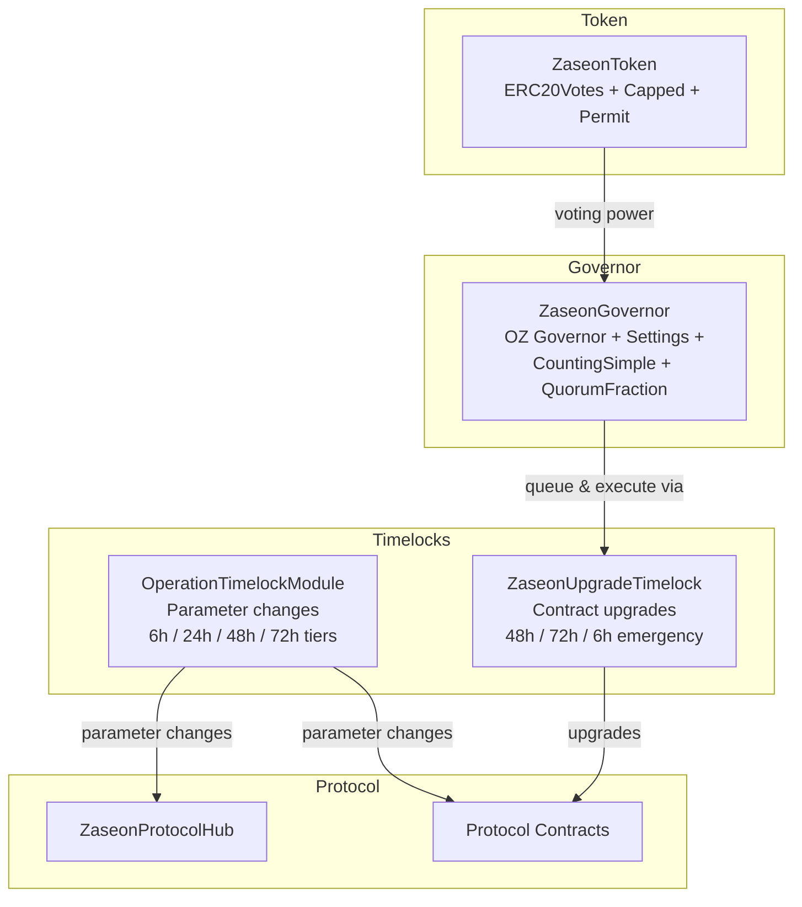
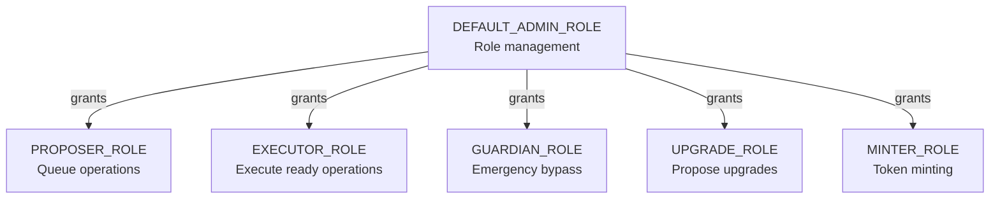
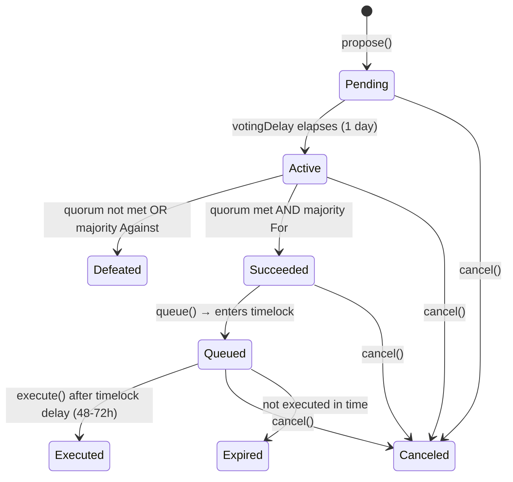

# ZASEON Governance

> **On-chain governance for the ZASEON protocol: token-weighted voting, timelocked execution, and multi-layered upgrade security.**

---

## Table of Contents

- [Overview](#overview)
- [Architecture](#architecture)
- [Contracts](#contracts)
  - [ZaseonGovernor](#zaseongovernor)
  - [ZaseonUpgradeTimelock](#zaseonupgradetimelock)
  - [OperationTimelockModule](#operationtimelockmodule)
  - [ZaseonToken](#zaseontoken)
  - [ZaseonGovernance (Removed)](#zaseongovernance-removed)
- [Roles & Permissions](#roles--permissions)
- [Proposal Lifecycle](#proposal-lifecycle)
- [Timelock](#timelock)
  - [Upgrade Timelock](#upgrade-timelock)
  - [Operation Timelock](#operation-timelock)
- [Governance Token](#governance-token)
- [SDK Integration](#sdk-integration)
- [Security Considerations](#security-considerations)

---

## Overview

ZASEON governance enables decentralized control over protocol upgrades, parameter changes, and operational decisions. The system is built on OpenZeppelin Governor (v5) with extensions tailored for multi-chain privacy infrastructure:

- **Token-weighted voting** via ERC-5805 (`ERC20Votes`) snapshots
- **Timelock-guarded execution** with 48–72 hour delays and a 24-hour user exit window
- **Two-tier timelocks**: `ZaseonUpgradeTimelock` for contract upgrades, `OperationTimelockModule` for day-to-day parameter changes
- **Emergency fast-track** with guardian multisig (6-hour delay)
- **Timestamp-based clock** for L2 compatibility (block numbers are unreliable across chains)

---

## Architecture



### Role Hierarchy



---

## Contracts

### ZaseonGovernor

**Path:** `contracts/governance/ZaseonGovernor.sol`
**Interface:** `contracts/interfaces/IZaseonGovernor.sol`

The primary governance contract. Composed from OpenZeppelin 5.x Governor extensions:

| Extension                     | Purpose                                                         |
| ----------------------------- | --------------------------------------------------------------- |
| `GovernorSettings`            | Configurable `votingDelay`, `votingPeriod`, `proposalThreshold` |
| `GovernorCountingSimple`      | For / Against / Abstain vote counting                           |
| `GovernorVotes`               | ERC-5805 token integration for voting power                     |
| `GovernorVotesQuorumFraction` | Quorum as a percentage of total supply                          |
| `GovernorTimelockControl`     | Proposals queue through `ZaseonUpgradeTimelock`                 |

**Default parameters:**

| Parameter          | Default            | Description                                   |
| ------------------ | ------------------ | --------------------------------------------- |
| Voting delay       | 1 day              | Time between proposal creation and vote start |
| Voting period      | 5 days             | Duration of the voting window                 |
| Proposal threshold | 100,000 ZASEON     | Minimum tokens to create a proposal           |
| Quorum             | 4% of total supply | Minimum participation for a valid vote        |

**Key functions:**

- `propose(targets, values, calldatas, description)` — Create a new proposal
- `castVote(proposalId, support)` — Vote on an active proposal
- `castVoteWithReason(proposalId, support, reason)` — Vote with an on-chain reason
- `queue(targets, values, calldatas, descriptionHash)` — Queue a succeeded proposal in the timelock
- `execute(targets, values, calldatas, descriptionHash)` — Execute after timelock delay
- `cancel(targets, values, calldatas, descriptionHash)` — Cancel a proposal
- `state(proposalId)` — Returns the current `ProposalState`

**Clock mode:** Uses `block.timestamp` (not block numbers) for L2 compatibility.

---

### ZaseonUpgradeTimelock

**Path:** `contracts/governance/ZaseonUpgradeTimelock.sol`
**Interface:** `contracts/interfaces/IZaseonUpgradeTimelock.sol`

Extends OpenZeppelin `TimelockController` with upgrade-specific security features. Serves as the execution backend for `ZaseonGovernor`.

**Delay tiers:**

| Tier      | Delay    | Use Case                                                    |
| --------- | -------- | ----------------------------------------------------------- |
| Standard  | 48 hours | Normal contract upgrades                                    |
| Critical  | 72 hours | Breaking changes, security-sensitive upgrades               |
| Emergency | 6 hours  | Critical fixes (requires `GUARDIAN_ROLE` + `emergencyMode`) |

**Additional features:**

- **User exit window** — 24-hour window before execution for users to withdraw
- **Multi-sig signatures** — Configurable minimum signature count (default: 2)
- **Upgrade freezing** — Individual contracts can be frozen to prevent upgrades
- **Emergency mode** — Guardian-activated mode that enables the 6-hour fast-track path

**Key functions:**

- `proposeUpgrade(target, data, salt, description)` — Standard 48h upgrade
- `proposeCriticalUpgrade(target, data, salt, description)` — Critical 72h upgrade
- `proposeEmergencyUpgrade(target, data, salt, description)` — Emergency 6h upgrade
- `signUpgrade(operationId)` — Add a multi-sig signature
- `executeUpgrade(target, data, predecessor, salt)` — Execute after delay + signatures
- `enableEmergencyMode()` / `disableEmergencyMode()` — Toggle emergency mode
- `freezeUpgrades(target)` — Permanently freeze upgrades for a contract

---

### OperationTimelockModule

**Path:** `contracts/governance/OperationTimelockModule.sol`

Complements `ZaseonUpgradeTimelock` by providing timelock protection for everyday admin operations: fee changes, threshold updates, role grants, bridge registrations, etc.

**Delay tiers:**

| Tier     | Delay    | Minimum Floor | Use Case                                    |
| -------- | -------- | ------------- | ------------------------------------------- |
| LOW      | 6 hours  | 3 hours       | Fee bps, cooldowns                          |
| MEDIUM   | 24 hours | 12 hours      | Threshold changes, subsystem registration   |
| HIGH     | 48 hours | 24 hours      | Role grants/revokes, bridge adapter changes |
| CRITICAL | 72 hours | 36 hours      | Emergency parameters, protocol-wide config  |

**Features:**

- Queue → delay → execute lifecycle with strict ordering
- Emergency bypass via guardian multisig (3-of-N guardians must approve)
- Operation cancellation with on-chain reason
- Batched operations (multiple calls in a single timelock)
- 7-day grace period after delay expires (must execute within window)
- Nonce-based replay protection

**Key functions:**

- `queueOperation(target, callData, value, tier, description)` — Queue with delay tier
- `executeOperation(operationId)` — Execute a ready operation
- `cancelOperation(operationId, reason)` — Cancel a queued operation
- `queueBatch(targets, callDatas, values, tier, description)` — Queue multiple calls
- `approveEmergencyBypass(operationId)` — Guardian approval for emergency skip

---

### ZaseonToken

**Path:** `contracts/governance/ZaseonToken.sol`

The ZASEON governance token. See [Governance Token](#governance-token) for details.

---

### ZaseonGovernance (Removed)

> **Removed.** The deprecated `ZaseonGovernance` TimelockController wrapper was removed. Use `ZaseonGovernor` for all governance operations.

---

## Roles & Permissions

### ZaseonGovernor / ZaseonUpgradeTimelock

| Role         | Identifier                           | Permissions                                       |
| ------------ | ------------------------------------ | ------------------------------------------------- |
| **Admin**    | `DEFAULT_ADMIN_ROLE`                 | Manage all roles, ultimate protocol authority     |
| **Proposer** | `PROPOSER_ROLE` (TimelockController) | Schedule transactions in the timelock             |
| **Executor** | `EXECUTOR_ROLE` (TimelockController) | Execute scheduled transactions after delay        |
| **Guardian** | `GUARDIAN_ROLE`                      | Enable emergency mode, propose emergency upgrades |
| **Upgrade**  | `UPGRADE_ROLE`                       | Propose standard and critical upgrades            |

### OperationTimelockModule

| Role         | Identifier           | Permissions                                |
| ------------ | -------------------- | ------------------------------------------ |
| **Admin**    | `DEFAULT_ADMIN_ROLE` | Manage roles, cancel any operation         |
| **Proposer** | `PROPOSER_ROLE`      | Queue operations and batches               |
| **Executor** | `EXECUTOR_ROLE`      | Execute ready operations                   |
| **Guardian** | `GUARDIAN_ROLE`      | Approve emergency bypass (3-of-N required) |

### ZaseonToken

| Role       | Identifier           | Permissions                 |
| ---------- | -------------------- | --------------------------- |
| **Admin**  | `DEFAULT_ADMIN_ROLE` | Grant/revoke roles          |
| **Minter** | `MINTER_ROLE`        | Mint new tokens (up to cap) |

---

## Proposal Lifecycle



### Step-by-Step

1. **Propose** — A token holder with ≥ 100,000 ZASEON calls `propose()` with target addresses, values, calldatas, and a description.

2. **Voting Delay** — 1-day waiting period before voting begins. Voting power is snapshotted at the proposal creation timestamp.

3. **Vote** — Token holders cast votes (`For`, `Against`, `Abstain`) during the 5-day voting period. Voting power is based on the snapshot, preventing flash-loan manipulation.

4. **Succeed or Defeat** — After the voting period, the proposal succeeds if ≥ 4% quorum is met and a simple majority voted `For`.

5. **Queue** — A succeeded proposal is queued in `ZaseonUpgradeTimelock` via `queue()`.

6. **Timelock Delay** — Standard 48-hour (or 72-hour for critical) waiting period. Users have a 24-hour exit window before execution.

7. **Execute** — After the delay, anyone with `EXECUTOR_ROLE` can call `execute()` to apply the changes.

8. **Cancel** — The proposer or guardian can cancel at any point before execution.

---

## Timelock

### Upgrade Timelock

`ZaseonUpgradeTimelock` handles contract upgrade proposals:

```
┌─────────────────┐     ┌─────────────────┐     ┌────────────────┐
│ Propose Upgrade │────►│ Timelock Queue  │────►│ Execute After  │
│ (Multi-sig)     │     │ (48-72 hours)   │     │ Delay          │
└─────────────────┘     └─────────────────┘     └────────────────┘
        │                       │                       │
        │               ┌───────▼───────┐               │
        │               │ User Exit     │               │
        │               │ Window (24h)  │               │
        │               └───────────────┘               │
        │                                               │
┌───────▼───────────────────────────────────────────────▼────────┐
│                    EMERGENCY PATH                              │
│  Guardian + emergencyMode → 6 hour delay → Execute             │
└────────────────────────────────────────────────────────────────┘
```

**Delay configuration:**

- Standard delay: **48 hours** (`STANDARD_DELAY`)
- Critical delay: **72 hours** (`EXTENDED_DELAY`)
- Emergency delay: **6 hours** (`EMERGENCY_DELAY`)
- Maximum delay: **7 days** (`MAX_DELAY`)
- User exit window: **24 hours** (`EXIT_WINDOW`)

**Multi-sig requirement:** Operations require a configurable minimum number of signatures (default: 2). Each signer with `UPGRADE_ROLE` calls `signUpgrade(operationId)`.

### Operation Timelock

`OperationTimelockModule` handles non-upgrade operational changes:

```
┌───────────┐     ┌──────────────┐     ┌─────────────┐     ┌─────────┐
│ Queue     │────►│ Delay        │────►│ Ready       │────►│ Execute │
│ (PROPOSER)│     │ (6-72 hours) │     │ (grace: 7d) │     │(EXECUTOR│
└───────────┘     └──────────────┘     └─────────────┘     └─────────┘
                                              │
                                       ┌──────▼──────┐
                                       │ Expired     │
                                       │ (after 7d)  │
                                       └─────────────┘
```

The grace period ensures stale operations automatically expire. Emergency bypass requires 3 guardian approvals.

---

## Governance Token

**Contract:** `ZaseonToken` (`contracts/governance/ZaseonToken.sol`)
**Symbol:** ZASEON | **Decimals:** 18

| Property   | Value                                  |
| ---------- | -------------------------------------- |
| Max Supply | 1,000,000,000 ZASEON (hard cap)        |
| Standard   | ERC-20 + ERC-20Votes + ERC-2612 Permit |
| Minting    | `MINTER_ROLE` only, respects cap       |
| Burning    | Any holder can burn their own tokens   |
| Transfer   | Unrestricted (no allowlist/blocklist)  |
| Clock      | Timestamp-based (L2-compatible)        |

### Delegation

> **⚠️ Important:** Tokens do **not** carry voting power by default. You **must** self-delegate (or delegate to another address) before you can vote or meet proposal thresholds.

Voting power requires **self-delegation**. Holding tokens alone does not grant voting power — holders must call `delegate(address)` to activate it:

```solidity
// Self-delegate to activate voting power
zaseonToken.delegate(msg.sender);

// Or delegate to another address
zaseonToken.delegate(delegateeAddress);
```

ERC-2612 `permit()` enables gasless delegation approval flows.

### Snapshots

`ERC20Votes` records a checkpoint of each account's voting power on every transfer and delegation. When a proposal is created, the snapshot timestamp is recorded. Votes are counted against that snapshot, making the system immune to flash-loan attacks.

---

## SDK Integration

The TypeScript SDK provides `GovernanceClient` for interacting with `ZaseonGovernor`:

```typescript
import { createPublicClient, createWalletClient, http, encodeFunctionData } from "viem";
import { arbitrum } from "viem/chains";
import {
  createGovernanceClient,
  VoteType,
  ProposalState,
} from "@zaseon/sdk/client/GovernanceClient";

// Setup clients
const publicClient = createPublicClient({ chain: arbitrum, transport: http() });
const walletClient = createWalletClient({ chain: arbitrum, transport: http(), account });

const governance = createGovernanceClient({
  publicClient,
  walletClient,
  governorAddress: "0x...",
});

// 1. Create a proposal
const txHash = await governance.propose(
  ["0xTargetContract"],            // targets
  [0n],                            // values (ETH)
  ["0xEncodedCalldata"],           // calldatas
  "Upgrade ShieldedPool to v2",    // description
);

// 2. Vote in favor
const proposalId = /* from proposal event */;
await governance.vote(proposalId, VoteType.For);

// Or vote with a reason
await governance.voteWithReason(proposalId, VoteType.For, "Supports privacy improvements");

// 3. Check proposal state
const proposal = await governance.getProposal(proposalId);
console.log(ProposalState[proposal.state]); // "Succeeded"
console.log(proposal.votes.forVotes);       // voting power in favor

// 4. Queue in timelock (after vote succeeds)
await governance.queue(
  ["0xTargetContract"], [0n], ["0xEncodedCalldata"],
  "Upgrade ShieldedPool to v2",
);

// 5. Execute (after timelock delay)
await governance.execute(
  ["0xTargetContract"], [0n], ["0xEncodedCalldata"],
  "Upgrade ShieldedPool to v2",
);

// Read-only queries
const threshold = await governance.getProposalThreshold(); // 100_000e18
const votingPower = await governance.getVotingPower(account.address);
const hasVoted = await governance.hasVoted(proposalId, account.address);
```

### GovernanceClient API

| Method                                                  | Type  | Description                         |
| ------------------------------------------------------- | ----- | ----------------------------------- |
| `propose(targets, values, calldatas, description)`      | Write | Create a new proposal               |
| `vote(proposalId, support)`                             | Write | Cast a vote (For/Against/Abstain)   |
| `voteWithReason(proposalId, support, reason)`           | Write | Cast a vote with on-chain reason    |
| `queue(targets, values, calldatas, description)`        | Write | Queue a succeeded proposal          |
| `execute(targets, values, calldatas, description)`      | Write | Execute after timelock              |
| `cancel(targets, values, calldatas, description)`       | Write | Cancel a proposal                   |
| `getProposal(proposalId)`                               | Read  | Get proposal state, votes, proposer |
| `getVotingPower(account, timepoint?)`                   | Read  | Get voting power at a timepoint     |
| `hasVoted(proposalId, account)`                         | Read  | Check if account has voted          |
| `getProposalThreshold()`                                | Read  | Minimum tokens to propose           |
| `getVotingDelay()`                                      | Read  | Delay before voting starts          |
| `getVotingPeriod()`                                     | Read  | Duration of voting window           |
| `getQuorum(timepoint)`                                  | Read  | Required quorum at a timepoint      |
| `hashProposal(targets, values, calldatas, description)` | Read  | Compute proposal ID                 |

---

## Security Considerations

### Flash Loan Protection

Voting power is determined by **timestamp-based snapshots** taken at proposal creation. An attacker cannot:

- Buy tokens, vote, and sell within a single block
- Use flash loans to inflate voting power

The snapshot is immutable once the proposal is created.

### Timelock Delays

All governance actions pass through a timelock:

- **48-hour minimum** for standard upgrades gives the community time to review
- **72-hour delay** for critical changes provides extra scrutiny
- **24-hour user exit window** ensures users can withdraw before a potentially harmful upgrade executes

### Emergency Safeguards

- Emergency upgrades require **both** `GUARDIAN_ROLE` and active `emergencyMode`
- `OperationTimelockModule` emergency bypass requires **3-of-N guardian approvals**
- Emergency delay (6 hours) is the absolute minimum — cannot be set lower

### Multi-Sig Requirements

- `ZaseonUpgradeTimelock` requires a configurable minimum number of signatures (default: 2)
- Signature count changes go through a two-step process with their own timelock
- Minimum signature floor prevents single-signer takeover

### Upgrade Freezing

Individual contracts can be permanently frozen via `freezeUpgrades(target)`, making them immutable and resistant to governance capture.

### Operational Security

- All state-changing functions in `OperationTimelockModule` are protected by `ReentrancyGuard`
- Zero-address validation on all critical setters
- Nonce-based replay protection for operation IDs
- 7-day grace period with automatic expiration prevents stale operations from executing unexpectedly
- Delay reduction requires a two-step process with minimum floors (50% of defaults)

### Role Separation

- **Proposers** and **executors** are separate roles — no single entity can both propose and execute
- `GUARDIAN_ROLE` is limited to emergency operations and cannot bypass normal governance
- `MINTER_ROLE` on `ZaseonToken` is independent from governance roles
