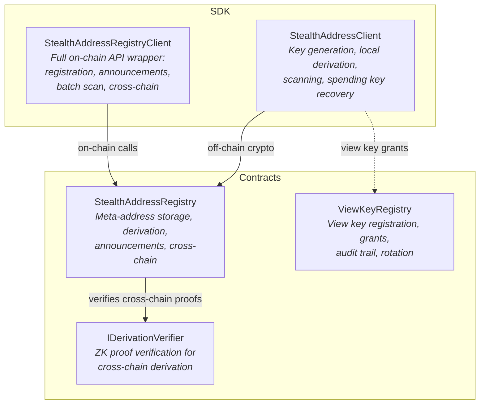
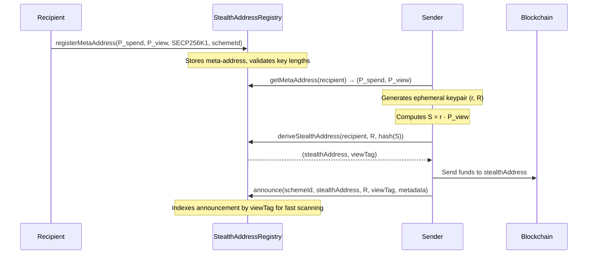
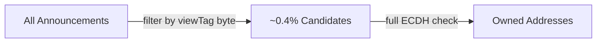
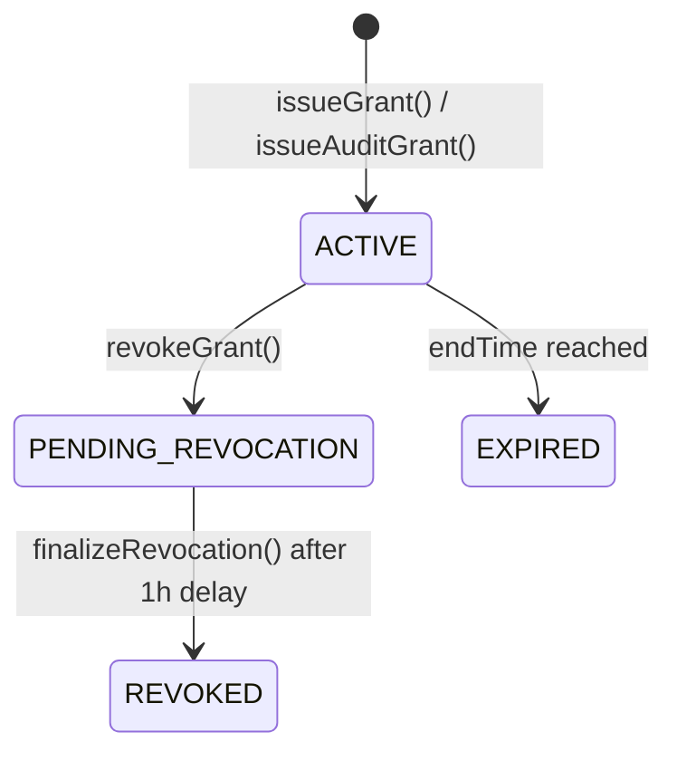
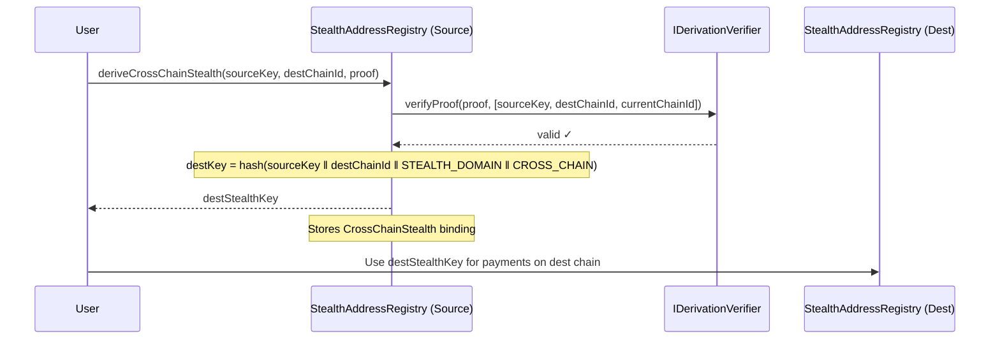

# Stealth Addresses

> **Unlinkable Payments via ERC-5564 Stealth Meta-Addresses in ZASEON**

[]()
[]()

---

## Table of Contents

- [Overview](#overview)
- [How It Works](#how-it-works)
- [Architecture](#architecture)
- [Stealth Address Generation](#stealth-address-generation)
- [Detection & Scanning](#detection--scanning)
- [Contract API](#contract-api)
- [SDK Usage](#sdk-usage)
- [View Key Management](#view-key-management)
- [Cross-Chain Stealth](#cross-chain-stealth)
- [Security Model](#security-model)

---

## Overview

Stealth addresses allow a sender to create a **one-time, unlinkable address** for every payment to a recipient — without any interaction from the recipient. An observer watching the chain sees funds going to a fresh address with no visible connection to the recipient's public identity.

ZASEON implements stealth addresses following the [ERC-5564](https://eips.ethereum.org/EIPS/eip-5564) standard (Stealth Addresses via an Announcement Registry), extended with:

- **Dual-Key Stealth Address Protocol (DKSAP)** — separate spending and viewing keys
- **View tags** — single-byte filter for 256× faster recipient scanning
- **Cross-chain stealth derivation** — reuse a single meta-address across L2s with ZK proofs
- **Multi-curve support** — secp256k1, ed25519, BLS12-381, BN254, Pallas/Vesta, and post-quantum curves (Dilithium, Kyber, Falcon, SPHINCS+)
- **Decentralised announcements** — role-gated or self-service (fee-based) announcement paths

### Why Stealth Addresses Matter

| Without Stealth Addresses                              | With Stealth Addresses                                  |
| ------------------------------------------------------ | ------------------------------------------------------- |
| Every payment goes to the same public address          | Every payment goes to a unique one-time address         |
| On-chain observers can link all incoming payments      | No observer can link two payments to the same recipient |
| Recipient's balance and transaction history are public | Recipient's aggregate activity is hidden                |

---

## How It Works

ZASEON uses the **Dual-Key Stealth Address Protocol (DKSAP)**. The recipient publishes two public keys — one for spending, one for viewing. The sender uses these to derive a fresh address that only the recipient can spend from or detect.

### Cryptographic Mechanism

1. **Recipient** generates two key pairs and publishes the public halves:
   - **Spending key pair**: $(s, P_{spend} = s \cdot G)$
   - **Viewing key pair**: $(v, P_{view} = v \cdot G)$

2. **Sender** generates a one-time ephemeral key pair:
   - $(r, R = r \cdot G)$

3. **Sender** computes the **shared secret** via ECDH:
   - $S = r \cdot P_{view}$

4. **Sender** derives the **stealth address**:
   - $P' = P_{spend} + \text{hash}(S) \cdot G$
   - The Ethereum address is derived from $P'$.

5. **Sender** publishes the ephemeral public key $R$ on-chain (announcement).

6. **Recipient** scans announcements using their **viewing key**:
   - $S' = v \cdot R$ (same shared secret since $v \cdot R = v \cdot r \cdot G = r \cdot v \cdot G = r \cdot P_{view}$)
   - Checks: does $P_{spend} + \text{hash}(S') \cdot G$ match the stealth address?

7. **Recipient** derives the **stealth private key** for spending:
   - $s' = s + \text{hash}(S')$

```
Sender                                 Recipient
──────                                 ─────────
                                       Publishes (P_spend, P_view)
Generates ephemeral (r, R)
Computes S = r · P_view
Derives P' = P_spend + hash(S)·G
Sends funds to P'
Publishes R on-chain (announcement)
                                       Scans: S' = v · R
                                       Checks P' == P_spend + hash(S')·G  ✓
                                       Derives spending key: s' = s + hash(S')
                                       Spends from P'
```

---

## Architecture

ZASEON's stealth address system is composed of two upgradeable contracts and two SDK clients.



### Component Roles

| Component                              | Role                                                                                                                                                                                                                                                                                               |
| -------------------------------------- | -------------------------------------------------------------------------------------------------------------------------------------------------------------------------------------------------------------------------------------------------------------------------------------------------- |
| **StealthAddressRegistry**             | Stores meta-addresses (spending + viewing public keys), derives stealth addresses, manages announcements indexed by view tag, handles cross-chain stealth derivation with ZK proofs, and provides batch scanning. UUPS-upgradeable with AccessControl roles (`OPERATOR`, `ANNOUNCER`, `UPGRADER`). |
| **ViewKeyRegistry**                    | Manages five types of view keys (Incoming, Outgoing, Full, Balance, Audit). Supports time-bounded grants with a revocation delay, key rotation, and a full audit trail. Pausable, UUPS-upgradeable.                                                                                                |
| **IDerivationVerifier**                | External ZK verifier contract for cross-chain stealth derivation proofs. Validates that a destination stealth key is correctly derived from a source key.                                                                                                                                          |
| **StealthAddressClient** (SDK)         | Off-chain cryptographic operations: key pair generation, local stealth address derivation, event log scanning, and stealth private key recovery.                                                                                                                                                   |
| **StealthAddressRegistryClient** (SDK) | Complete TypeScript wrapper for every on-chain function: registration, dual-key stealth, announcements, batch scanning, cross-chain derivation, and admin operations.                                                                                                                              |

---

## Stealth Address Generation

### Step-by-Step Flow



### On-Chain Derivation

The contract derives the stealth address deterministically:

```
stealthKeyHash = keccak256(STEALTH_DOMAIN ‖ P_spend ‖ sharedSecretHash)
stealthAddress = address(uint160(uint256(stealthKeyHash)))
viewTag        = bytes1(sharedSecretHash)   // first byte → 256× scan speedup
```

The domain separator `STEALTH_DOMAIN = keccak256("Zaseon_STEALTH_ADDRESS_V1")` isolates the derivation from other protocols.

### Dual-Key Stealth

For scenarios requiring on-chain recording, `computeDualKeyStealth()` takes hashed key components and stores a full `DualKeyStealth` record:

```solidity
computeDualKeyStealth(
    bytes32 spendingPubKeyHash,
    bytes32 viewingPubKeyHash,
    bytes32 ephemeralPrivKeyHash,
    uint256 chainId
) → (bytes32 stealthHash, address derivedAddress)
```

This records the relationship between spending key, viewing key, ephemeral key, shared secret, and derived address — enabling later ownership verification.

---

## Detection & Scanning

### View Tags

Every announcement includes a **view tag** — the first byte of the shared secret. Recipients scan by:

1. Filtering announcements by their expected view tag (`getAnnouncementsByViewTag(tag)`)
2. This eliminates ~255/256 (~99.6%) of announcements immediately
3. For the ~0.4% remaining, the recipient performs the full ECDH check



### Batch Scanning

The contract provides `batchScan()` for on-chain ownership verification:

```solidity
batchScan(
    bytes32 viewingPrivKeyHash,
    bytes32 spendingPubKeyHash,
    address[] candidates
) → address[] owned
```

For each candidate, it recomputes the expected stealth address from the announcement's ephemeral public key and the recipient's key hashes, returning only matches.

### Ownership Check

`checkStealthOwnership()` verifies a single address:

```
S' = hash(viewingPrivKeyHash ‖ ephemeralPubKey ‖ STEALTH_DOMAIN)
expectedAddress = address(hash(spendingPubKeyHash ‖ S'))
isOwner = (expectedAddress == stealthAddress)
```

---

## Contract API

### StealthAddressRegistry

#### Meta-Address Management

| Function                                                                  | Description                                                                                            |
| ------------------------------------------------------------------------- | ------------------------------------------------------------------------------------------------------ |
| `registerMetaAddress(spendingPubKey, viewingPubKey, curveType, schemeId)` | Register a stealth meta-address. One active registration per address. Validates key lengths per curve. |
| `updateMetaAddressStatus(newStatus)`                                      | Toggle between ACTIVE and INACTIVE. Cannot re-activate REVOKED keys.                                   |
| `revokeMetaAddress()`                                                     | Permanently revoke. Irreversible.                                                                      |
| `getMetaAddress(owner)`                                                   | Read a registered meta-address.                                                                        |

#### Stealth Derivation

| Function                                                                                      | Description                                                     |
| --------------------------------------------------------------------------------------------- | --------------------------------------------------------------- |
| `deriveStealthAddress(recipient, ephemeralPubKey, sharedSecretHash)`                          | Derive a one-time stealth address and view tag (view function). |
| `computeDualKeyStealth(spendingPubKeyHash, viewingPubKeyHash, ephemeralPrivKeyHash, chainId)` | Compute and record a dual-key stealth address on-chain.         |

#### Announcements

| Function                                                                        | Description                                              |
| ------------------------------------------------------------------------------- | -------------------------------------------------------- |
| `announce(schemeId, stealthAddress, ephemeralPubKey, viewTag, metadata)`        | Emit a stealth announcement (requires `ANNOUNCER_ROLE`). |
| `announcePrivate(schemeId, stealthAddress, ephemeralPubKey, viewTag, metadata)` | Self-service announcement, requires ≥ 0.0001 ETH fee.    |

#### Scanning

| Function                                                                        | Description                                           |
| ------------------------------------------------------------------------------- | ----------------------------------------------------- |
| `getAnnouncementsByViewTag(viewTag)`                                            | Get all stealth addresses for a view tag byte.        |
| `checkStealthOwnership(stealthAddress, viewingPrivKeyHash, spendingPubKeyHash)` | Check if a stealth address belongs to the given keys. |
| `batchScan(viewingPrivKeyHash, spendingPubKeyHash, candidates)`                 | Batch ownership check over an array of candidates.    |

#### Cross-Chain

| Function                                                                  | Description                                             |
| ------------------------------------------------------------------------- | ------------------------------------------------------- |
| `deriveCrossChainStealth(sourceStealthKey, destChainId, derivationProof)` | Derive a stealth key for another chain with a ZK proof. |

#### Admin

| Function                          | Description                                           |
| --------------------------------- | ----------------------------------------------------- |
| `setDerivationVerifier(address)`  | Set the ZK derivation verifier contract (admin only). |
| `withdrawFees(recipient, amount)` | Withdraw accumulated announcement fees (admin only).  |

### Supported Curves & Key Lengths

| Curve              | Type                   | Key Lengths (bytes)                |
| ------------------ | ---------------------- | ---------------------------------- |
| `SECP256K1`        | Classical              | 33 (compressed), 65 (uncompressed) |
| `ED25519`          | Classical              | 32                                 |
| `BLS12_381`        | Classical              | 48 (G1), 96 (G2)                   |
| `BN254`            | Classical              | 32, 64                             |
| `PALLAS` / `VESTA` | Classical              | 32                                 |
| `DILITHIUM`        | Post-Quantum (ML-DSA)  | 1312, 1952, 2592                   |
| `KYBER`            | Post-Quantum (ML-KEM)  | 800, 1184, 1568                    |
| `FALCON`           | Post-Quantum (FN-DSA)  | 897, 1793                          |
| `SPHINCS_PLUS`     | Post-Quantum (SLH-DSA) | 32, 64                             |

---

## SDK Usage

### StealthAddressClient — Off-Chain Crypto

```typescript
import { StealthAddressClient, StealthScheme } from "@zaseon/sdk";
import { createPublicClient, createWalletClient, http } from "viem";
import { arbitrum } from "viem/chains";

const publicClient = createPublicClient({ chain: arbitrum, transport: http() });
const walletClient = createWalletClient({
  chain: arbitrum,
  transport: http(),
  account,
});

const client = new StealthAddressClient(
  "0xStealthRegistryAddress",
  publicClient,
  walletClient,
);

// 1. Recipient: generate a stealth meta-address
const meta = StealthAddressClient.generateMetaAddress(StealthScheme.SECP256K1);
// → { spendingPrivKey, spendingPubKey, viewingPrivKey, viewingPubKey }

// 2. Recipient: register on-chain
await client.registerMetaAddress(meta.spendingPubKey, meta.viewingPubKey);

// 3. Sender: compute a one-time stealth address
const { stealthAddress, ephemeralPubKey, viewTag, ephemeralPrivKey } =
  await client.computeStealthAddress(stealthId);

// 4. Sender: announce the payment
await client.announcePayment(stealthAddress, ephemeralPubKey);

// 5. Recipient: scan for payments
const payments = await client.scanAnnouncements(
  meta.viewingPrivKey,
  meta.spendingPubKey,
  fromBlock,
);

// 6. Recipient: derive spending key
const stealthPrivKey = StealthAddressClient.deriveStealthPrivateKey(
  meta.spendingPrivKey,
  meta.viewingPrivKey,
  payments[0].ephemeralPubKey,
);
```

### StealthAddressRegistryClient — Full On-Chain API

```typescript
import { StealthAddressRegistryClient, CurveType } from "@zaseon/sdk";

const registry = new StealthAddressRegistryClient(
  "0xStealthRegistryAddress",
  publicClient,
  walletClient,
);

// Register meta-address (ERC-5564 scheme 1)
await registry.registerMetaAddress(
  spendingPubKey,
  viewingPubKey,
  CurveType.SECP256K1,
  1n,
);

// Derive stealth address for a recipient
const { stealthAddress, viewTag } = await registry.deriveStealthAddress(
  recipientAddr,
  ephemeralPubKey,
  sharedSecretHash,
);

// Self-service announcement (0.0001 ETH fee)
await registry.announcePrivate(1n, stealthAddress, ephemeralPubKey, viewTag);

// Batch scan for owned addresses
const owned = await registry.batchScan(
  viewingPrivKeyHash,
  spendingPubKeyHash,
  candidates,
);

// Cross-chain stealth derivation
const destKey = await registry.deriveCrossChainStealth(sourceKey, 10n, zkProof);

// Get registry statistics
const stats = await registry.getStats();
// → { registeredCount, announcementCount, crossChainDerivationCount }
```

---

## View Key Management

The **ViewKeyRegistry** enables selective disclosure — letting recipients reveal transaction visibility to chosen parties without exposing spending authority.

### View Key Types

| Type       | Access Level                           |
| ---------- | -------------------------------------- |
| `INCOMING` | See incoming transactions only         |
| `OUTGOING` | See outgoing transactions only         |
| `FULL`     | See all transactions                   |
| `BALANCE`  | See current balance only               |
| `AUDIT`    | Time-limited full access (max 30 days) |

### Grant Lifecycle



Key constraints:

- **Grant duration**: minimum 1 hour, maximum 365 days (30 days for audit grants)
- **Max grants per account**: 100
- **Revocation delay**: 1 hour (gives grantee notice)
- **Key rotation**: `rotateViewKey()` automatically propagates the new key hash to all active grants

### Audit Trail

Every access through a grant is recorded in the `auditTrail` mapping with the grant ID, accessor address, timestamp, and a cryptographic access proof — providing a tamper-evident log.

### Example: Granting Audit Access

```solidity
// Register a FULL view key
viewKeyRegistry.registerViewKey(ViewKeyType.FULL, publicKey, commitment);

// Grant 7-day audit access to an auditor
bytes32 grantId = viewKeyRegistry.issueAuditGrant(
    auditorAddress,
    7 days,
    scope  // e.g., specific chain or contract
);

// Later: revoke early if needed (1-hour delay applies)
viewKeyRegistry.revokeGrant(grantId);
```

---

## Cross-Chain Stealth

ZASEON extends stealth addresses across L2 networks. A single meta-address registered on one chain can derive unlinkable stealth addresses on any supported chain.

### How It Works



### Derivation Details

- **ZK proof verification**: The `IDerivationVerifier` contract validates that the derivation is cryptographically correct. Public inputs include the source key, destination chain ID, and current chain ID.
- **Chain separation**: The destination key includes the chain ID in its derivation, preventing the same stealth key from being reused across chains.
- **Binding storage**: Each cross-chain derivation creates a `CrossChainStealth` record linking the source and destination keys with the proof and timestamps.
- **Duplicate prevention**: A binding ID is computed from `(sourceKey, destKey)` and the contract rejects duplicate bindings.
- **Mainnet safety**: On Ethereum mainnet (chain ID 1), a verifier contract is required. Testnets fall back to a basic cryptographic check.

### Supported L2 Networks

Arbitrum, Optimism, Base, zkSync Era, Scroll, Linea, and Polygon zkEVM — each with a dedicated bridge adapter in the ZASEON protocol.

---

## Security Model

### Key Separation

The dual-key design provides a fundamental security boundary:

| Key                             | Held By                           | Capability                              |
| ------------------------------- | --------------------------------- | --------------------------------------- |
| **Spending private key** ($s$)  | Recipient only                    | Move funds from stealth addresses       |
| **Viewing private key** ($v$)   | Recipient + authorised grantees   | Detect incoming payments (cannot spend) |
| **Ephemeral private key** ($r$) | Sender only (discarded after use) | Derive one stealth address (single-use) |

Compromising the viewing key reveals incoming transactions but **cannot** be used to steal funds.

### On-Chain Protections

- **ReentrancyGuard** on all state-changing functions (`registerMetaAddress`, `computeDualKeyStealth`, `announce`, `announcePrivate`, `deriveCrossChainStealth`)
- **Key length validation** per curve type — rejects incorrectly sized keys at registration
- **Hash collision prevention** — all internal hashing uses `abi.encode` (not `abi.encodePacked`) to prevent collisions with variable-length inputs
- **Zero-address checks** on stealth addresses in announcements
- **View tag index cap** — `MAX_ANNOUNCEMENTS_PER_TAG = 10,000` prevents unbounded storage growth
- **Announcement expiry** — 90-day TTL on announcements
- **Domain separation** — `STEALTH_DOMAIN` prevents cross-protocol key reuse
- **UUPS upgradeability** — `UPGRADER_ROLE` required, with `_disableInitializers()` in constructors

### Metadata Leakage Prevention

| Threat                                 | Mitigation                                                                                    |
| -------------------------------------- | --------------------------------------------------------------------------------------------- |
| Linking payments to the same recipient | Each payment uses a fresh ephemeral key and stealth address                                   |
| Timing correlation                     | Announcements can be batched or relayed through ZASEON's relayer network                      |
| Fee payment linking                    | `announcePrivate` accepts fees from any address, decoupling announcement from sender identity |
| Cross-chain linking                    | Chain-separated derivation keys; ZK proofs hide the derivation relationship                   |
| View key over-exposure                 | Granular key types (INCOMING, BALANCE, etc.) and time-bounded grants limit disclosure scope   |

### Privacy Guarantees

1. **Unlinkability** — No on-chain observer can determine that two stealth addresses belong to the same recipient without the viewing key.
2. **Sender privacy** — The ephemeral key $R$ reveals nothing about the sender's identity.
3. **Forward secrecy** — Compromising the viewing key does not reveal spending authority. Each ephemeral key is single-use and discarded.
4. **Selective disclosure** — The ViewKeyRegistry allows recipients to prove specific facts (balance, transaction history) to authorised parties without revealing their full activity.

---

## Related Documentation

- [Architecture](ARCHITECTURE.md) — overall system design
- [Cross-Chain Privacy](CROSS_CHAIN_PRIVACY.md) — privacy middleware mechanics
- [Privacy Middleware](PRIVACY_MIDDLEWARE.md) — modular privacy architecture
- [Integration Guide](INTEGRATION_GUIDE.md) — SDK setup and usage
- [EIP Draft](EIP_DRAFT.md) — ZASEON's EIP contribution

## Related Contracts

- `contracts/privacy/StealthAddressRegistry.sol`
- `contracts/privacy/ViewKeyRegistry.sol`
- `contracts/privacy/StealthContractFactory.sol`
- `contracts/privacy/EncryptedStealthAnnouncements.sol`
- `contracts/interfaces/IStealthAddressRegistry.sol`
- `contracts/upgradeable/StealthAddressRegistryUpgradeable.sol`
