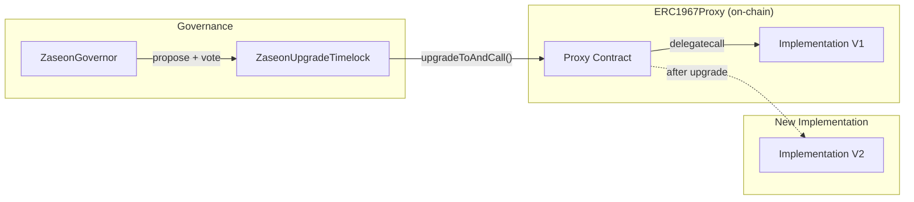
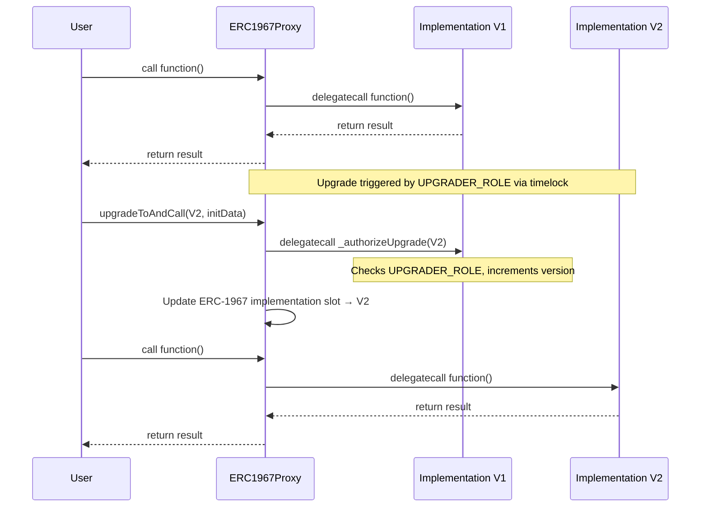
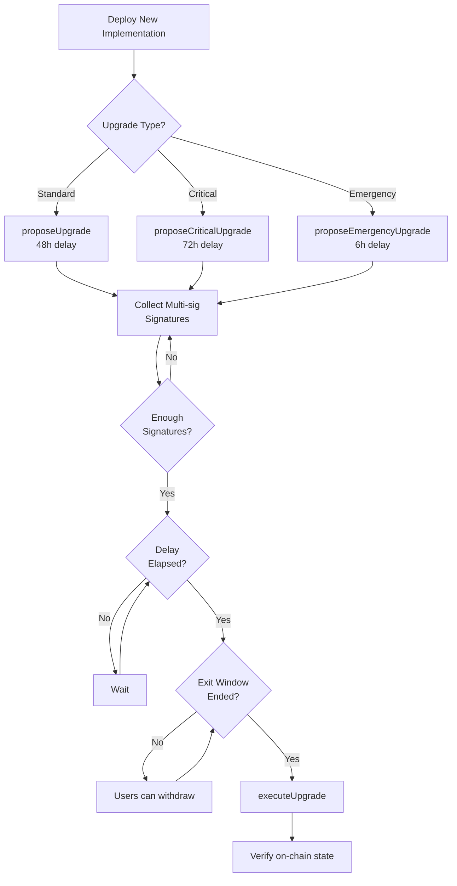
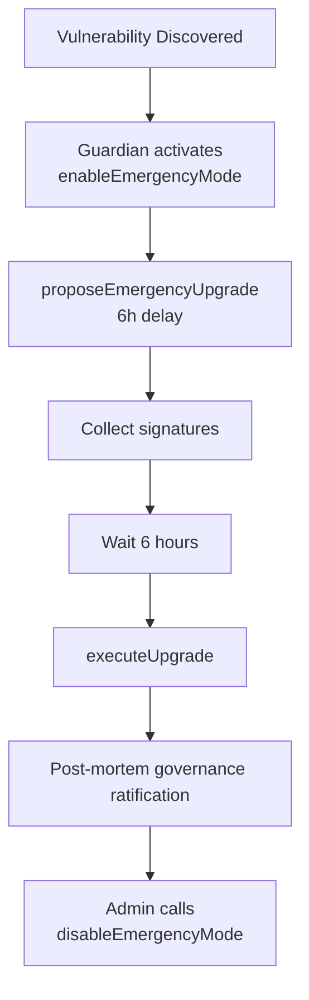
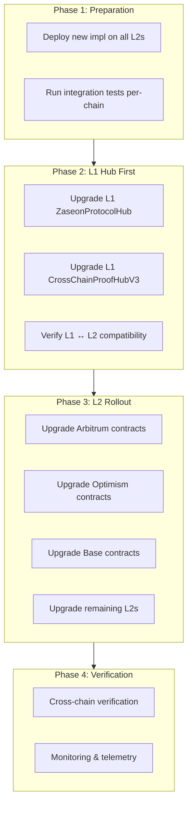

# Upgrade Guide

> **Complete guide to upgrading ZASEON protocol contracts using the UUPS proxy pattern**

[-blue.svg>)]()
[]()
[]()

---

## Table of Contents

- [Overview](#overview)
- [Why Upgradeability Matters](#why-upgradeability-matters)
- [UUPS Proxy Pattern](#uups-proxy-pattern)
  - [How UUPS Works](#how-uups-works)
  - [ERC-1967 Storage Slots](#erc-1967-storage-slots)
  - [Why UUPS Over Alternatives](#why-uups-over-alternatives)
- [Upgradeable Contracts](#upgradeable-contracts)
- [Upgrade Authorization](#upgrade-authorization)
  - [UPGRADER_ROLE](#upgrader_role)
  - [\_authorizeUpgrade Implementation](#_authorizeupgrade-implementation)
  - [Contract Version Tracking](#contract-version-tracking)
- [Upgrade Process](#upgrade-process)
  - [Standard Upgrade (48 hours)](#standard-upgrade-48-hours)
  - [Critical Upgrade (72 hours)](#critical-upgrade-72-hours)
  - [Emergency Fast-Track (6 hours)](#emergency-fast-track-6-hours)
- [ZaseonUpgradeTimelock](#zaseonupgradetimelock)
  - [Delay Tiers](#delay-tiers)
  - [Multi-Sig Requirements](#multi-sig-requirements)
  - [User Exit Window](#user-exit-window)
  - [Upgrade Freezing](#upgrade-freezing)
- [Storage Layout](#storage-layout)
  - [Storage Layout Rules](#storage-layout-rules)
  - [Storage Gaps](#storage-gaps)
  - [Named Storage Slots](#named-storage-slots)
  - [Immutable-to-Storage Conversions](#immutable-to-storage-conversions)
- [Writing an Upgrade](#writing-an-upgrade)
  - [1. Implement the New Version](#1-implement-the-new-version)
  - [2. Deploy the New Implementation](#2-deploy-the-new-implementation)
  - [3. Submit Upgrade Proposal](#3-submit-upgrade-proposal)
  - [4. Collect Signatures](#4-collect-signatures)
  - [5. Execute After Delay](#5-execute-after-delay)
- [Testing Upgrades](#testing-upgrades)
  - [Storage Preservation Tests](#storage-preservation-tests)
  - [Storage Layout Consistency Tests](#storage-layout-consistency-tests)
  - [Authorization Tests](#authorization-tests)
  - [Running Upgrade Tests](#running-upgrade-tests)
- [Emergency Upgrades](#emergency-upgrades)
  - [Emergency Mode Activation](#emergency-mode-activation)
  - [Emergency Upgrade Flow](#emergency-upgrade-flow)
  - [Post-Emergency Ratification](#post-emergency-ratification)
- [Cross-Chain Upgrade Coordination](#cross-chain-upgrade-coordination)
  - [Multi-L2 Deployment Challenge](#multi-l2-deployment-challenge)
  - [Coordinated Upgrade Strategy](#coordinated-upgrade-strategy)
  - [Emergency Cross-Chain Propagation](#emergency-cross-chain-propagation)
- [Checklist](#checklist)
  - [Pre-Upgrade](#pre-upgrade)
  - [During Upgrade](#during-upgrade)
  - [Post-Upgrade](#post-upgrade)
- [Related Files](#related-files)

---

## Overview

ZASEON uses the **UUPS (Universal Upgradeable Proxy Standard)** pattern (ERC-1822) for all upgradeable contracts. Upgrades are gated by `ZaseonUpgradeTimelock`, which enforces delay periods, multi-sig requirements, and user exit windows.

The protocol targets 7 L2 networks (Arbitrum, Optimism, Base, zkSync, Scroll, Linea). Polygon zkEVM support is planned. Upgrading requires careful coordination to maintain cross-chain consistency of proof verification, nullifier tracking, and state lock management.



---

## Why Upgradeability Matters

ZASEON is cross-chain ZK privacy middleware. Upgradeability is critical because:

1. **ZK circuit evolution** — As Noir circuits are optimized or new proof systems emerge, verifier contracts must be updated to accept new proof formats
2. **Cross-chain protocol changes** — L2 networks update their native bridge interfaces (e.g., Arbitrum retryable ticket changes, OP Stack message format updates)
3. **Security patches** — Privacy-critical code (nullifier registries, shielded pools) must be patchable without requiring users to migrate state
4. **Regulatory compliance** — Selective disclosure and compliance reporting logic may need updates as regulations evolve
5. **State preservation** — Encrypted commitments, Merkle trees, and nullifier sets represent billions in user value and cannot be migrated

---

## UUPS Proxy Pattern

### How UUPS Works

In the UUPS pattern, the upgrade logic lives in the **implementation contract** (not the proxy). The proxy is a minimal `delegatecall` forwarder that stores state and delegates all calls to the current implementation.



Key properties:

- **Proxy is immutable** — The proxy contract never changes, only the implementation pointer
- **State lives in the proxy** — All storage reads/writes happen in the proxy's context
- **Upgrade logic is in the impl** — `_authorizeUpgrade()` is defined in the implementation, not the proxy
- **Can remove upgradeability** — Deploy an implementation without `_authorizeUpgrade()` to permanently freeze

### ERC-1967 Storage Slots

The proxy uses standardized storage slots (EIP-1967) to avoid collisions with implementation storage:

| Slot                                                                 | Purpose                | Value                                                             |
| -------------------------------------------------------------------- | ---------------------- | ----------------------------------------------------------------- |
| `0x360894a13ba1a3210667c828492db98dca3e2076cc3735a920a3ca505d382bbc` | Implementation address | `bytes32(uint256(keccak256("eip1967.proxy.implementation")) - 1)` |
| `0xb53127684a568b3173ae13b9f8a6016e243e63b6e8ee1178d6a717850b5d6103` | Admin address          | `bytes32(uint256(keccak256("eip1967.proxy.admin")) - 1)`          |

These slots are computed to be effectively random, making collision with normal sequential storage variables statistically impossible.

### Why UUPS Over Alternatives

Per [ADR-005](adr/ADR-005-uups-proxy-pattern.md):

| Pattern            | Gas/Call   | Proxy Complexity            | Why Rejected                                           |
| ------------------ | ---------- | --------------------------- | ------------------------------------------------------ |
| **UUPS**           | Lowest     | Minimal                     | **Chosen** — gas savings, OZ 5.x support, simple proxy |
| Transparent        | +2,100 gas | Admin slot check every call | Higher gas per-call across 7 L2s                       |
| Diamond (ERC-2535) | Variable   | High                        | Over-engineered for our pattern; complex storage       |
| Beacon             | Low        | Low                         | For many instances of same contract; not our pattern   |

---

## Upgradeable Contracts

All upgradeable variants live in `contracts/upgradeable/` and follow the naming convention `*Upgradeable.sol`:

| Contract                     | Upgradeable Variant                       | Description                                  |
| ---------------------------- | ----------------------------------------- | -------------------------------------------- |
| ZaseonProtocolHub            | `ZaseonProtocolHubUpgradeable`            | Central coordination hub, component registry |
| CrossChainProofHubV3         | `CrossChainProofHubV3Upgradeable`         | Proof aggregation, optimistic verification   |
| NullifierRegistryV3          | `NullifierRegistryV3Upgradeable`          | Cross-domain nullifier tracking (CDNA)       |
| ZKBoundStateLocks            | `ZKBoundStateLocksUpgradeable`            | Cross-chain state locks with ZK unlock       |
| ProofCarryingContainer       | `ProofCarryingContainerUpgradeable`       | Self-authenticating state containers         |
| UniversalShieldedPool        | `UniversalShieldedPoolUpgradeable`        | Multi-asset shielded pool with ZK deposits   |
| ConfidentialStateContainerV3 | `ConfidentialStateContainerV3Upgradeable` | Encrypted state management                   |
| DirectL2Messenger            | `DirectL2MessengerUpgradeable`            | Direct L2-to-L2 messaging                    |
| DynamicRoutingOrchestrator   | `DynamicRoutingOrchestratorUpgradeable`   | Bridge route optimization                    |
| CapacityAwareRouter          | `CapacityAwareRouterUpgradeable`          | Quote-and-execute proof routing              |
| PrivacyRouter                | `PrivacyRouterUpgradeable`                | Privacy-preserving routing frontend          |
| ZaseonAtomicSwapV2           | `ZaseonAtomicSwapV2Upgradeable`           | Atomic cross-chain swaps with HTLC           |
| IntentCompletionLayer        | `IntentCompletionLayerUpgradeable`        | Proof service marketplace                    |
| InstantCompletionGuarantee   | `InstantCompletionGuaranteeUpgradeable`   | Bonded proof delivery guarantees             |
| Zaseonv2Orchestrator         | `Zaseonv2OrchestratorUpgradeable`         | V2 primitive orchestrator                    |

**Common inheritance chain** for all upgradeable contracts:

```
Initializable
├── AccessControlUpgradeable
├── ReentrancyGuardUpgradeable
├── PausableUpgradeable
└── UUPSUpgradeable
```

Each contract also defines:

- `UPGRADER_ROLE` — Role required for `_authorizeUpgrade()`
- `contractVersion` — Auto-incrementing version counter
- `uint256[50] private __gap` — Storage gap for future upgrades
- `@custom:oz-upgrades-from` — NatSpec tag linking to the non-upgradeable base

---

## Upgrade Authorization

### UPGRADER_ROLE

Every upgradeable contract gates `_authorizeUpgrade()` behind `UPGRADER_ROLE`:

```solidity
bytes32 public constant UPGRADER_ROLE = keccak256("UPGRADER_ROLE");
// 0x189ab7a9244df0848122154315af71fe140f3db0fe014031783b0946b8c9d2e3
```

In production, `UPGRADER_ROLE` is granted to the `ZaseonUpgradeTimelock` contract — never to an EOA. The timelock enforces delay periods before the upgrade can execute.

### \_authorizeUpgrade Implementation

All upgradeable contracts use the same pattern:

```solidity
function _authorizeUpgrade(
    address /* newImplementation */
) internal override onlyRole(UPGRADER_ROLE) {
    uint256 oldVersion = contractVersion;
    contractVersion++;
    emit ContractUpgraded(oldVersion, contractVersion);
}
```

This ensures:

1. Only `UPGRADER_ROLE` holders can trigger upgrades
2. The `contractVersion` is atomically incremented
3. An event is emitted for off-chain monitoring

### Contract Version Tracking

Every upgradeable contract maintains a `contractVersion` state variable:

- Set to `1` in `initialize()`
- Incremented on each upgrade in `_authorizeUpgrade()`
- Queryable on-chain to verify which version is running
- Used by monitoring systems to detect successful upgrades

---

## Upgrade Process



### Standard Upgrade (48 hours)

For routine upgrades — feature additions, non-breaking optimizations:

1. **Deploy** new implementation contract
2. **Propose** via `proposeUpgrade(target, data, salt, description)` (requires `UPGRADE_ROLE`)
3. **Sign** — Additional signers call `signUpgrade(operationId)` until `minSignatures` (default: 2) is met
4. **Wait** 48 hours for the timelock delay
5. **Exit window** — 24-hour window before execution for users to withdraw
6. **Execute** via `executeUpgrade(target, data, predecessor, salt)`

### Critical Upgrade (72 hours)

For breaking changes, security-sensitive modifications, storage layout changes:

1. Same flow as standard but with `proposeCriticalUpgrade()` → 72-hour delay
2. Marked as `isCritical = true` in the `UpgradeProposal` struct
3. Extended delay gives users more time to review and exit

### Emergency Fast-Track (6 hours)

For critical security patches only:

1. **Activate emergency mode** — Guardian calls `enableEmergencyMode()`
2. **Propose** via `proposeEmergencyUpgrade()` (requires `GUARDIAN_ROLE` + `emergencyMode`)
3. **Sign** — Collect multi-sig signatures
4. **Wait** 6 hours (no user exit window for emergencies)
5. **Execute** the upgrade
6. **Ratify** — Post-mortem governance vote to ratify the emergency action
7. **Disable** — Admin calls `disableEmergencyMode()`

---

## ZaseonUpgradeTimelock

**Path:** `contracts/governance/ZaseonUpgradeTimelock.sol`
**Interface:** `contracts/interfaces/IZaseonUpgradeTimelock.sol`

Extends OpenZeppelin `TimelockController` with upgrade-specific security.

### Delay Tiers

| Tier      | Constant          | Delay    | Use Case                                |
| --------- | ----------------- | -------- | --------------------------------------- |
| Standard  | `STANDARD_DELAY`  | 48 hours | Normal contract upgrades                |
| Critical  | `EXTENDED_DELAY`  | 72 hours | Breaking changes, storage modifications |
| Emergency | `EMERGENCY_DELAY` | 6 hours  | Critical security fixes                 |
| Maximum   | `MAX_DELAY`       | 7 days   | Upper bound for any delay               |

### Multi-Sig Requirements

- Default `minSignatures = 2`
- The proposer's address auto-counts as the first signature
- Additional signers call `signUpgrade(operationId)`
- Signature count increases are instant (more secure)
- Signature count decreases require 48-hour delay via `proposeMinSignatures()` / `confirmMinSignatures()`

### User Exit Window

```
|--- Timelock delay (48-72h) ---|--- Exit window (24h) ---|--- Executable ---|
^                                ^                         ^
proposal                    exitWindowEnds             executableAt
```

The `EXIT_WINDOW` (24 hours) gives users time to withdraw funds before the upgrade executes. Emergency upgrades bypass this window.

### Upgrade Freezing

Individual contracts can be permanently frozen to prevent upgrades:

```solidity
// DEFAULT_ADMIN_ROLE only
upgradeTimelock.setUpgradeFrozen(proxyAddress, true);
```

Once frozen, no upgrade proposals can be created for that target. This is the path to making a contract immutable.

---

## Storage Layout

### Storage Layout Rules

Violating storage layout rules corrupts on-chain state. These rules are **mandatory**:

1. **Never reorder** existing storage variables
2. **Never remove** existing storage variables (use `deprecated_` prefix if unused)
3. **Always append** new variables at the end, before `__gap`
4. **Never change types** of existing variables (e.g., `uint128` → `uint256` corrupts adjacent slots)
5. **Reduce `__gap`** by the number of new slots added
6. **No immutables** in upgradeable contracts — use storage variables instead
7. **Constructors are forbidden** — use `initialize()` with `Initializable`

### Storage Gaps

Every upgradeable contract reserves 50 storage slots for future use:

```solidity
/// @dev Reserved storage gap for future upgrades (50 slots)
uint256[50] private __gap;
```

When adding `N` new state variables (each occupying 1 slot), reduce the gap:

```solidity
// Before: added 2 new uint256 variables
uint256 public newFeatureA;         // slot from __gap
uint256 public newFeatureB;         // slot from __gap
uint256[48] private __gap;          // reduced from 50 to 48
```

### Named Storage Slots

For complex storage that needs collision-free placement, `contracts/upgradeable/StorageLayout.sol` provides deterministic slots:

```solidity
library StorageSlots {
    bytes32 public constant PC3_CONTAINERS_SLOT =
        keccak256("zaseon.storage.pc3.containers");
    bytes32 public constant PC3_NULLIFIERS_SLOT =
        keccak256("zaseon.storage.pc3.nullifiers");
    bytes32 public constant CDNA_DOMAINS_SLOT =
        keccak256("zaseon.storage.cdna.domains");
    bytes32 public constant ORCH_PRIMITIVES_SLOT =
        keccak256("zaseon.storage.orchestrator.primitives");
    // ...
}
```

The `StorageLayoutReport` contract in the same file generates reports for on-chain verification of slot consistency across upgrades.

### Immutable-to-Storage Conversions

Proxies cannot use Solidity `immutable` variables (they're embedded in implementation bytecode, not storage). All upgradeable variants convert immutables to regular storage:

| Non-Upgradeable                      | Upgradeable                                                      |
| ------------------------------------ | ---------------------------------------------------------------- |
| `immutable uint256 CHAIN_ID`         | `uint256 public chainId` (set in `initialize()`)                 |
| `immutable address proofVerifier`    | `address public proofVerifier` (set in `initialize()`)           |
| `immutable address zaseonHub`        | `address public zaseonHub` (set in `initialize()`)               |
| `immutable bytes32 DOMAIN_SEPARATOR` | Computed in `initialize()` using `address(this)` (proxy address) |

---

## Writing an Upgrade

### 1. Implement the New Version

Create a new implementation that extends the existing upgradeable contract:

```solidity
// contracts/upgradeable/MyContractV2Upgradeable.sol
contract MyContractV2Upgradeable is MyContractUpgradeable {
    // New state variables go AFTER existing ones, BEFORE __gap
    uint256 public newFeature;

    // Use reinitializer(N) for the Nth upgrade — NOT initializer
    function initializeV2(uint256 _newFeature) external reinitializer(2) {
        newFeature = _newFeature;
    }

    // Reduce __gap by 1 slot used:
    // uint256[49] private __gap;  // was 50
}
```

> **Critical:** Use `reinitializer(2)` for the second version, `reinitializer(3)` for the third, etc. Never reuse `initializer`.

### 2. Deploy the New Implementation

```bash
# Deploy just the implementation (not behind a proxy)
forge create contracts/upgradeable/MyContractV2Upgradeable.sol:MyContractV2Upgradeable \
    --rpc-url $RPC_URL \
    --private-key $DEPLOYER_KEY
```

### 3. Submit Upgrade Proposal

Encode the `upgradeToAndCall` calldata and submit through the timelock:

```solidity
// Encode the proxy's upgradeToAndCall
bytes memory upgradeData = abi.encodeCall(
    UUPSUpgradeable.upgradeToAndCall,
    (
        newImplementationAddress,
        abi.encodeCall(MyContractV2.initializeV2, (initialValue))
    )
);

// Standard upgrade (48h delay)
bytes32 operationId = upgradeTimelock.proposeUpgrade(
    proxyAddress,      // target proxy
    upgradeData,       // encoded upgradeToAndCall
    salt,              // unique salt
    "Upgrade MyContract to V2: add newFeature"
);

// OR critical upgrade (72h delay) for storage layout changes
bytes32 operationId = upgradeTimelock.proposeCriticalUpgrade(
    proxyAddress,
    upgradeData,
    salt,
    "Critical: Upgrade MyContract V2 with new storage slots"
);
```

### 4. Collect Signatures

Additional UPGRADE_ROLE holders sign the proposal:

```solidity
// Each signer calls:
upgradeTimelock.signUpgrade(operationId);
```

### 5. Execute After Delay

Once the timelock delay has elapsed, `minSignatures` are collected, and the exit window has ended:

```solidity
upgradeTimelock.executeUpgrade(
    proxyAddress,
    upgradeData,
    bytes32(0),   // predecessor (0 if none)
    salt
);
```

---

## Testing Upgrades

The `test/upgradeable/` directory contains 20 test files covering all upgradeable contracts. All upgrade tests follow established patterns.

### Storage Preservation Tests

Verify that state survives proxy upgrades:

```solidity
function test_storagePreservedAfterUpgrade() public {
    // Verify initial state
    uint256 vBefore = contract.contractVersion();
    assertEq(vBefore, 1);

    // Deploy V2 implementation
    MyContractUpgradeable newImpl = new MyContractUpgradeable();

    // Upgrade via UPGRADER_ROLE
    vm.prank(upgrader);
    contract.upgradeToAndCall(address(newImpl), "");

    // Verify state preserved + version incremented
    assertTrue(contract.hasRole(contract.DEFAULT_ADMIN_ROLE(), admin));
    assertEq(contract.contractVersion(), 2);
}
```

### Storage Layout Consistency Tests

The `StorageLayoutConsistency.t.sol` test:

1. Deploys each upgradeable contract behind an `ERC1967Proxy`
2. Initializes with known state
3. Verifies state is accessible through the proxy
4. Simulates an upgrade and verifies state preservation
5. Confirms that bare implementations cannot be initialized (constructor calls `_disableInitializers()`)

```solidity
function test_implementationCannotBeInitialized() public {
    ZKBoundStateLocksUpgradeable impl = new ZKBoundStateLocksUpgradeable();

    // Calling initialize on implementation should revert
    vm.expectRevert();
    impl.initialize(admin, makeAddr("verifier"));
}
```

### Authorization Tests

Every upgradeable contract test includes:

```solidity
function test_upgradeByUpgrader() public {
    MyContractUpgradeable newImpl = new MyContractUpgradeable();
    vm.prank(upgrader);
    contract.upgradeToAndCall(address(newImpl), "");
    assertEq(contract.contractVersion(), 2);
}

function test_upgradeByNonUpgrader_reverts() public {
    MyContractUpgradeable newImpl = new MyContractUpgradeable();
    vm.prank(user);
    vm.expectRevert();
    contract.upgradeToAndCall(address(newImpl), "");
}
```

### Running Upgrade Tests

```bash
# Run all upgrade tests
forge test --match-path "test/upgradeable/*" -vvv

# Run storage layout tests specifically
forge test --match-path "test/upgradeable/StorageLayout*" -vvv

# Run a specific contract's upgrade tests
forge test --match-path "test/upgradeable/ZaseonProtocolHubUpgradeable.t.sol" -vvv

# Skip heavy contracts for faster iteration
FOUNDRY_PROFILE=fast forge test --match-path "test/upgradeable/*" -vvv \
    --skip AggregatorHonkVerifier --skip CrossChainPrivacyHub
```

**Certora formal verification** also covers upgrade invariants:

```bash
# Verify timelock properties
certoraRun certora/conf/verify_timelock.conf

# Verify shielded pool upgrade invariants
certoraRun certora/conf/verify_upgradeable_shielded_pool.conf
```

---

## Emergency Upgrades

### Emergency Mode Activation



### Emergency Upgrade Flow

1. **Detection** — Security monitoring detects a critical vulnerability
2. **Triage** — Security team (Guardian role holders) assesses severity
3. **Enable emergency mode**:
   ```solidity
   // GUARDIAN_ROLE only
   upgradeTimelock.enableEmergencyMode();
   ```
4. **Deploy fix** — Deploy patched implementation
5. **Propose emergency upgrade**:
   ```solidity
   // GUARDIAN_ROLE only, requires emergencyMode == true
   upgradeTimelock.proposeEmergencyUpgrade(
       proxyAddress,
       upgradeData,
       salt,
       "EMERGENCY: Fix critical reentrancy in ShieldedPool"
   );
   ```
6. **Collect signatures** — Multi-sig holders sign
7. **Execute** after 6-hour delay (no user exit window)
8. **Verify** — Confirm fix on-chain, run integration tests

### Post-Emergency Ratification

After the emergency upgrade:

1. Submit a governance proposal explaining the emergency action
2. The community votes to ratify or roll back
3. Disable emergency mode via `disableEmergencyMode()` (requires `DEFAULT_ADMIN_ROLE`)
4. Publish a post-mortem detailing the vulnerability, fix, and timeline

---

## Cross-Chain Upgrade Coordination

### Multi-L2 Deployment Challenge

ZASEON is deployed across 7 L2 networks. Upgrades must be coordinated because:

- **Proof verification** — A proof generated on Arbitrum and verified on Optimism requires compatible verifier versions on both chains
- **Nullifier tracking** — The `NullifierRegistryV3` on each chain must agree on the nullifier format
- **State locks** — `ZKBoundStateLocks` on the source chain must be compatible with the destination chain's version
- **Bridge adapters** — Each L2 has its own bridge adapter that may depend on the hub version

### Coordinated Upgrade Strategy



**Recommended order:**

1. **Deploy implementations** on all chains (no proxy update yet)
2. **Upgrade L1 hub** — `ZaseonProtocolHub` and `CrossChainProofHubV3` first
3. **Upgrade L2s sequentially** — Arbitrum → Optimism → Base → remaining
4. **Verify cross-chain** — Test proof relay between each chain pair
5. **Enable new features** — If the upgrade adds new functionality, enable it after all chains are updated

### Emergency Cross-Chain Propagation

The `CrossChainEmergencyRelay` contract propagates emergency state across all L2 deployments:

- `ProtocolEmergencyCoordinator` calls `broadcastEmergency()` to fan out severity-level messages
- Each L2's receiver contract decodes the message and triggers local pause/unpause
- Heartbeat liveness — L2 receivers auto-pause if no heartbeat arrives within the configured window
- Replay protection via per-chain emergency nonces + chain ID validation
- Fail-open on send — if one chain's relay fails, others still receive the message

For coordinated emergency upgrades across chains:

1. Broadcast emergency pause via `CrossChainEmergencyRelay`
2. Deploy patched implementations on all affected chains
3. Execute emergency upgrades per-chain (6-hour timelock each)
4. Broadcast resume via `CrossChainEmergencyRelay`

---

## Checklist

### Pre-Upgrade

- [ ] New implementation compiles without errors
- [ ] Storage layout compatibility verified — no slot collisions
- [ ] `reinitializer(N)` used with the correct version number
- [ ] New state variables appended at end, before `__gap`
- [ ] `__gap` reduced by the number of new slots added
- [ ] No `immutable` variables introduced (use storage instead)
- [ ] No constructor logic (all init in `initialize()` / `reinitializer()`)
- [ ] `@custom:oz-upgrades-from` NatSpec tag present
- [ ] All existing tests pass against new implementation
- [ ] Upgrade-specific tests written and passing (storage preservation, auth)
- [ ] `StorageLayoutConsistency.t.sol` tests pass
- [ ] Certora spec updated if the change is security-critical
- [ ] Timelock delay appropriate for change severity (48h / 72h)
- [ ] Cross-chain compatibility verified if deployed on multiple L2s
- [ ] Implementation cannot be initialized directly (constructor calls `_disableInitializers()`)

### During Upgrade

- [ ] Upgrade proposal submitted with descriptive explanation
- [ ] Required multi-sig signatures collected (`minSignatures` met)
- [ ] Timelock delay has fully elapsed
- [ ] User exit window has ended (non-emergency only)
- [ ] Target contract is not frozen (`upgradeFrozen[target] == false`)
- [ ] Monitoring alerts configured for the upgrade transaction

### Post-Upgrade

- [ ] `contractVersion` incremented (verify on-chain)
- [ ] `ContractUpgraded` event emitted with correct version numbers
- [ ] All roles preserved through proxy (admin, operator, guardian)
- [ ] State variables accessible with correct values
- [ ] Cross-chain proof relay still functional (if applicable)
- [ ] Nullifier verification working across chains (if applicable)
- [ ] Monitoring dashboards show normal operation
- [ ] Emergency upgrade ratified by governance (if emergency path used)
- [ ] Documentation updated in deployment records

---

## Related Files

| File                                                  | Purpose                                            |
| ----------------------------------------------------- | -------------------------------------------------- |
| `contracts/upgradeable/`                              | All 15 UUPS-upgradeable contract variants          |
| `contracts/upgradeable/StorageLayout.sol`             | Deterministic storage slot library + layout report |
| `contracts/governance/ZaseonUpgradeTimelock.sol`      | Timelocked upgrade controller                      |
| `contracts/interfaces/IZaseonUpgradeTimelock.sol`     | Timelock interface                                 |
| `contracts/governance/ZaseonGovernor.sol`             | Governance proposal system                         |
| `contracts/crosschain/CrossChainEmergencyRelay.sol`   | Emergency propagation across L2s                   |
| `contracts/security/ProtocolEmergencyCoordinator.sol` | Multi-role emergency coordination                  |
| `test/upgradeable/`                                   | 20 test files for upgrade behavior                 |
| `certora/specs/UpgradeableShieldedPool.spec`          | Formal verification of upgrade invariants          |
| `certora/conf/verify_timelock.conf`                   | Certora config for timelock verification           |
| `docs/adr/ADR-005-uups-proxy-pattern.md`              | Architecture decision record for UUPS              |
| `docs/GOVERNANCE.md`                                  | Full governance documentation                      |
